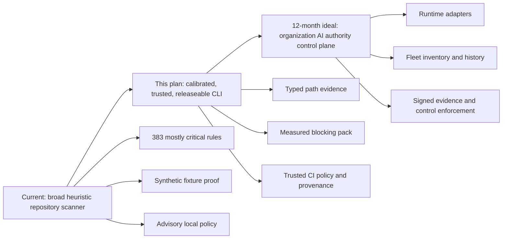
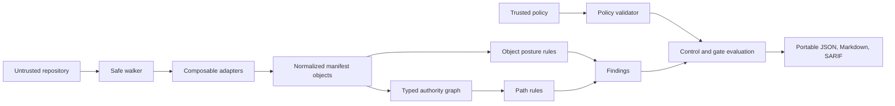
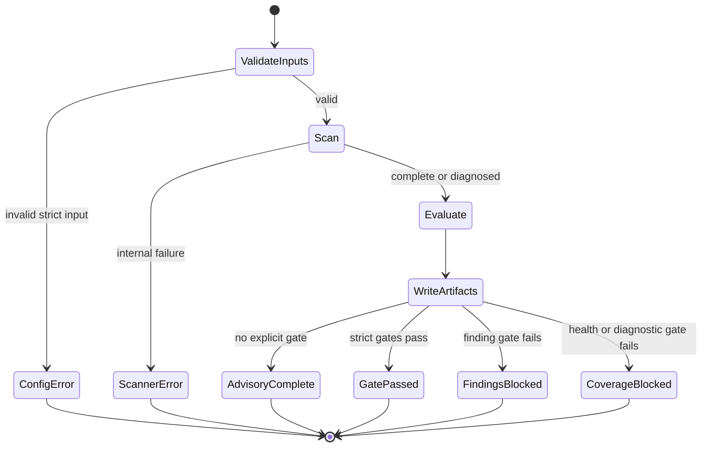
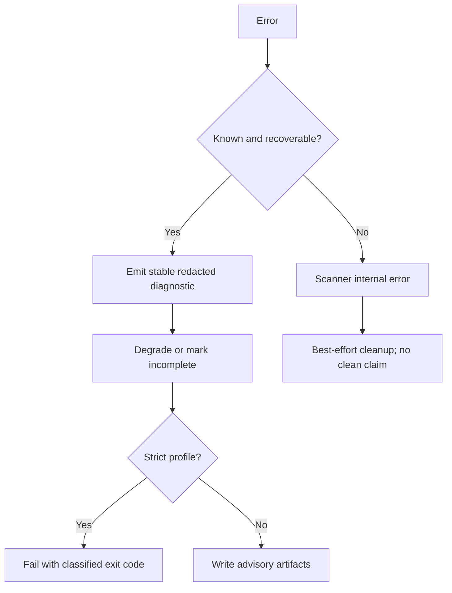
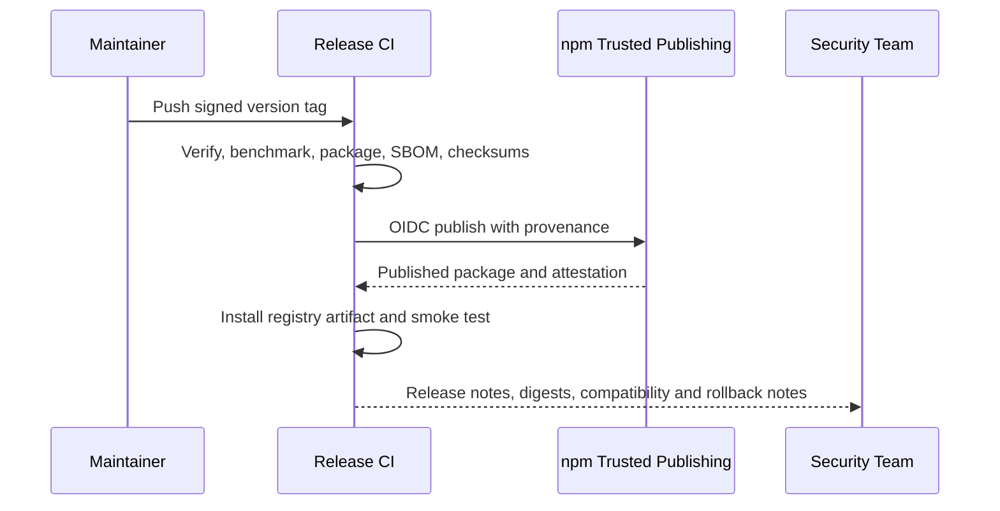
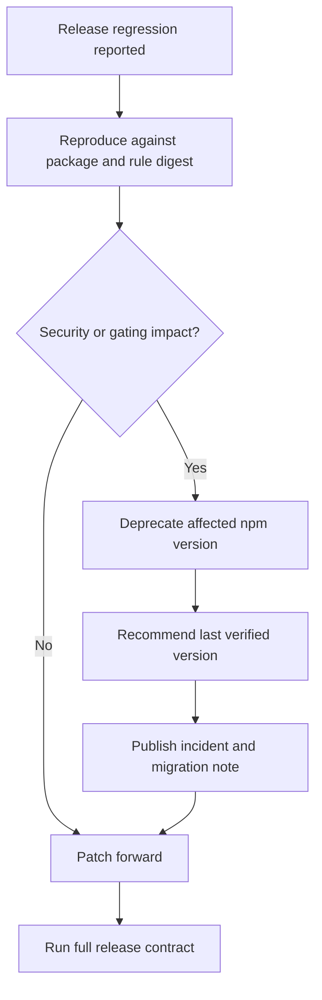

# Production Hardening Plan

AgentCSP should become useful to cybersecurity teams by producing high-confidence findings with evidence, not by maximizing alert volume.

## Autoplan Phase 1: CEO Review

Review date: 2026-07-15

Review mode: `SELECTIVE_EXPANSION`

Current launch verdict: **v0.2 public-preview release candidate, advisory use only**. The implementation now has a trusted strict profile, bounded and deterministic scanning, ownership-aware artifact transactions, classified failures, lifecycle commands, release provenance controls, package verification, and a 159-test regression suite. It is suitable for production evaluation as an advisory repository scanner. It is not yet approved as an enforcement-grade blocking control because independent real-repository detection calibration and completed cross-platform release evidence remain open.

### v0.2 Evidence Update

Evidence recorded on 2026-07-15:

- `pnpm verify:release` passes end to end, including schema, version, rule, package, fixture, redaction, dependency, and performance gates.
- The installed-package smoke test verifies both workspace packages and all 383 packaged rules through a clean package-manager tarball installation, with Windows-safe command execution.
- The recommended ruleset contains 17 bounded advisory rules; the 383-rule research catalog remains opt-in as `extended`.
- A 150-case synthetic parser-conformance benchmark passes with no mismatches. It is explicitly non-enforcement-eligible and is not presented as production precision evidence.
- The five-run scale gate indexes 5,000 files and 104,860,000 bytes at 1,766 ms p95 and 177,717,248 bytes peak RSS on the documented reference host.
- Two independent code-review rounds found and closed output-lock ownership, unresolved runtime-profile, baseline-error-classification, trusted-input time-of-check/time-of-use, shared scanner-version, and semantic minimum-version defects with regression tests.
- Protected-profile tests prove that explicit policy and baseline inputs are rejected unless they carry a matching SHA-256 digest, resolve outside the scan root, and are regular files.
- CycloneDX 1.6 SBOM generation is deterministic and the release workflow produces checksums and GitHub attestations from immutable action pins.

Remaining enforcement-grade blockers are deliberately narrow: an independently labeled real-repository corpus for any enforcement-eligible rule, successful registry provenance, and external security-user evaluation. The advisory public preview additionally requires a successful Linux/macOS/Windows package-install matrix on the pushed commit. Until enforcement evidence exists, all findings and policies remain recommendations rather than claims of runtime blocking.

### Launch Review Closure

The Autoplan CEO, engineering, and developer-experience review record is complete. A post-fix independent CEO and security-product re-review found no P0 or P1 blocker for pushing the advisory, source-built public-preview candidate. It verified that package smoke execution uses `pnpm.cmd` and the Node runtime on Windows, and that trusted policy and baseline inputs reject non-regular files before they are read. The review also independently reran the focused trust/CLI tests, full 159-test suite, lint, and scale envelope.

This is an AI-assisted engineering review, not a substitute for an external professional security assessment. The pushed commit must still pass the hosted Verify, Linux/Node 20, Windows/Node 22, and macOS/Node 24 jobs before the preview is announced. npm publication, GitHub release tagging, and enforcement-grade claims remain out of scope until their documented prerequisites are satisfied.

### Locked Premises

| Premise | Decision | Reason |
| --- | --- | --- |
| AgentCSP focuses on AI security | Accepted | This is the differentiated problem and avoids diluting the release with general software supply-chain scanning. |
| The CLI ships before a dashboard | Accepted | The manifest, evidence, rule, and policy contracts must stabilize before a platform depends on them. |
| AppSec and platform-security engineers are the first users | Accepted | They own repository controls, CI adoption, triage, and exception governance. |
| High-confidence evidence matters more than finding count | Accepted | Security teams will not keep a gate enabled if severity and confidence are not empirically credible. |
| Core scanning is local-first and requires no hosted service | Accepted | This is a trust, adoption, and vendor-neutrality requirement. |
| Runtime enforcement and a hosted control plane are outside this release | Accepted | Static repository posture must be proven before runtime adapters or organization-wide state are introduced. |
| The current implementation is production-ready after documentation polish | Rejected | Trusted-policy bypass, uncalibrated scoring, single-surface dispatch, and release-distribution gaps are launch blockers. |

### Strategic Reframe

The first production product is **an evidence-led AI agent repository posture scanner**, not yet a centralized enforcement control plane. Its wedge is proving how untrusted context can reach agent authority across MCP, tools, prompts, RAG, memory, CI, and runtime configuration. The CLI may emit policy recommendations and static attack paths, but it must not claim runtime blocking or organization-wide deployment inventory.

The product becomes defensible when typed provenance and authority paths drive a small, calibrated blocking rule pack. Adding more flat heuristic rules before that evidence exists would increase maintenance and alert volume without improving trust.

### What Already Exists

| Sub-problem | Existing implementation | Reuse decision |
| --- | --- | --- |
| Conservative traversal | `packages/core/src/scanner/walk.ts` applies deterministic ordering, size and file limits, hidden-folder handling, default ignores, and coverage health | Reuse and harden read-time containment and diagnostics. |
| Secret-safe evidence | `read-safe.ts`, evidence schemas, report and SARIF redaction checks | Reuse as a non-negotiable invariant. |
| Normalized agent inventory | Zod schemas and detector output cover instructions, skills, MCP, tools, prompts, RAG, memory, runtime, CI, and automations | Reuse; split detector ownership without changing output semantics unnecessarily. |
| Deterministic identifiers | `stableId`, rule-pack fingerprints, manifest fingerprints, sorted outputs | Reuse and add golden compatibility tests. |
| Static relationships and attack paths | Graph builder, relationship schema, attack-path reports, and static blast-radius summary | Move graph construction before qualifying high-confidence path rules. |
| Open rule packs | Constrained YAML rules, schema validation, packaged built-in assets | Reuse; introduce maturity and calibration metadata, then separate blocking and advisory packs. |
| Advisory policy | Trust overrides, recommended controls, expiring suppressions, policy diagnostics | Reuse after establishing a trusted enforcement-policy boundary and unsuppressible meta-findings. |
| CI interfaces | JSON, Markdown, SARIF, baseline comparison, confidence and health gates | Reuse; add a safe strict profile, distinct exit codes, and trusted-policy examples. |
| Package verification | Tarball checks, installed-tree smoke test, version checks, fixture output checks, npm audit | Reuse inside a cross-platform release pipeline with provenance and SBOM output. |
| Synthetic regression fixtures | Vulnerable and safe agent repositories plus 114 tests | Keep for regression; do not treat them as precision or recall evidence. |

### Dream State



### Implementation Alternatives

| Approach | Scope | Effort | Risk | Advantages | Disadvantages | Decision |
| --- | --- | --- | --- | --- | --- | --- |
| A. Polish and publish | README, icon, package release, existing tests | Low | Critical | Fastest public launch | Preserves policy bypass, uncalibrated severity, silent false negatives, and unsupported claims | Rejected |
| B. Evidence-led production CLI | Trusted policy, multi-surface adapters, calibrated core pack, benchmark corpus, strict CI profile, release provenance, lifecycle commands | High | Controlled | Produces a credible security product and preserves the CLI-first strategy | Requires reducing claims and classifying many rules as advisory until measured | **Selected** |
| C. Build platform and runtime enforcement now | Dashboard, service, adapters, organization database, runtime policy | Very high | Critical | Broader long-term platform story | Multiplies unstable contracts before static detection is proven | Deferred |

### Scope Decisions

Accepted into this release plan:

- Establish a trusted-policy input and make scanner-integrity findings unsuppressible.
- Replace mutually exclusive file dispatch with composable parser adapters.
- Build a small graph-native, empirically calibrated blocking pack; retain the broader pack as advisory until measured.
- Separate impact, exploitability, and detector certainty in scoring and reporting.
- Add a labeled benchmark corpus with precision, recall, duplicate-rate, crash-rate, and performance gates.
- Add a strict CI profile, stable exit-code contract, atomic private outputs, and read-time path containment.
- Add CLI lifecycle commands for validation, rule discovery/explanation, diagnostics, and deterministic baseline management.
- Add a supported-platform matrix, trusted npm publishing with provenance, SBOMs, checksums, release notes, and rollback documentation.
- Rewrite product positioning and README around the shipped CLI, with a distinct professional terminal and repository identity.

Deferred or rejected:

- Dashboard and hosted platform: contracts and adoption evidence must stabilize first.
- Runtime policy enforcement: requires independent adapters and a threat model beyond static scanning.
- General-purpose software supply-chain security: outside the AI-security product focus; scanner self-provenance remains in scope.
- Organization-wide deployment inventory: requires durable deployment identity and a service-side data model.
- Ticketing, Slack, email, and SIEM integrations: stable JSON and SARIF are the release interface; native integrations follow demonstrated demand.
- Signed or tamper-evident evidence: schema readiness is sufficient for this release.
- Deep secret-value scanning: default behavior remains key-name and reference detection only.
- Full interprocedural analysis for every language: supported AST tiers ship incrementally; unsupported analysis stays advisory and explicit.

### CEO NOT in Scope

The deferred and rejected items above are explicitly not part of the v0.2 release gate. They remain roadmap candidates only after the scanner's trust, evidence, calibration, and distribution contracts are proven.

### Temporal Interrogation

| Time | Expected result | Failure signal |
| --- | --- | --- |
| Hour 1 | A new user installs the package, runs `agentcsp scan .`, understands the receipt, and sees portable artifacts without local-path leakage | Install fails, output claims enforcement, or the first report is dominated by unexplained criticals |
| Hour 2 | The user can validate config, inspect a rule, understand evidence, and distinguish advisory from blocking findings | The only workflow is opening large JSON files or reading rule YAML manually |
| Hour 4 | The user adopts an advisory CI workflow with complete scan-health and SARIF output | A malformed policy or parser silently converts a scan into a clean result |
| Hour 6 | The user enables a trusted strict profile for only the calibrated blocking pack | Repository-controlled policy can suppress the gate, or exit behavior is ambiguous |
| Week 2 | Security teams can baseline existing risk, review narrow expiring suppressions, and measure new-risk gates | Broad suppressions hide policy-integrity findings or baselines cannot be reproduced |
| Month 3 | Real repository corpus metrics and user triage show stable precision and useful remediation | Rule count grows while benchmark quality, adoption, and time-to-triage do not improve |

Mode confirmed: `SELECTIVE_EXPANSION`. Production-critical CLI capabilities are accepted; platform and runtime work are deferred.

### Outside Voices

#### CODEX SAYS (CEO - strategy challenge)

The independent Codex review found 13 launch-impact concerns: five critical, seven high, and one medium. The critical findings were a repository-controlled policy bypass, a graph that does not drive rule evaluation, a hardening document without measurable release gates, structurally inflated severity/confidence, and first-match file classification that silently misses combined configurations. The review also flagged regex-only source analysis, insufficient validation, over-broad market claims, fail-open operational defaults, missing lifecycle commands, incomplete release provenance, weak manifest identity governance, and unnecessary artifact metadata.

Launch recommendation: private alpha in advisory mode until these gaps are closed.

#### CLAUDE SUBAGENT (CEO - strategic independence)

Unavailable in this environment. This phase is tagged `[codex-only]`; a missing voice is not counted as consensus.

| Dimension | Claude | Codex | Consensus |
| --- | --- | --- | --- |
| Premises valid? | N/A | Mostly valid after narrowing the product claim | Flagged, no two-model confirmation |
| Right problem to solve? | N/A | Yes, if path evidence replaces flat breadth as the wedge | Flagged, no two-model confirmation |
| Scope calibration correct? | N/A | No; calibration and release engineering must precede more detections | Flagged, no two-model confirmation |
| Alternatives sufficiently explored? | N/A | No; publish-now and platform-now must be explicitly rejected | Flagged, no two-model confirmation |
| Competitive and market risks covered? | N/A | No; credibility will be lost without empirical signal quality | Flagged, no two-model confirmation |
| Six-month trajectory sound? | N/A | No; current trajectory creates a larger heuristic monolith | Flagged, no two-model confirmation |

### Section 1: Architecture Review

Findings:

1. Rule evaluation currently precedes graph construction, so relationship-dependent claims are not proven by the rule engine.
2. A 40,000-line detector combines dispatch, parsing, classification, framework adaptation, and data-flow approximation in one ownership boundary.
3. First-match dispatch exits after one recognized shape and can miss additional surfaces in combined framework configuration.
4. Regex source analysis and structured configuration parsing are not separated into explicit support and confidence tiers.

Decision: introduce composable adapters that return zero or more normalized objects plus diagnostics; build the graph before path rules; keep the constrained object-rule DSL for posture rules and add a constrained graph-rule schema for proven source-to-sink paths. Do not permit custom JavaScript rule execution.

### Section 2: Error and Rescue Map

| Method or boundary | Failure class | Current rescue | Required rescue | User impact |
| --- | --- | --- | --- | --- |
| Root traversal | unreadable root, permission, path race | Root error aborts; subtree errors become diagnostics | Preserve abort for invalid root; add stable error code and read-time containment | Clear scanner failure, no partial clean claim |
| Directory traversal | unreadable subtree, max-files limit | Diagnostic or incomplete health | Strict profile must fail; advisory profile must surface bounded diagnostic | Explicit partial coverage |
| File stat/read | replaced file, symlink race, permission, invalid bytes | Stat is rescued; read can throw; symlinks skipped by directory entry type | Open without following links where supported, verify containment, rescue reads into diagnostics | No crash and no out-of-root read |
| Structured parser | malformed JSON/YAML/TOML | Mostly diagnostic and continue | Record adapter, section, stable code, and health degradation | Actionable parser failure |
| Project policy load | missing or invalid explicit config | Diagnostic and empty policy | Advisory mode may continue; strict mode fails configuration; trusted policy is separate | No silent policy loss |
| Rule-pack load | malformed or duplicate project rule | Diagnostic and continue | Built-in calibrated pack failure is internal error; project pack failure is explicit degraded scan | No false clean gate |
| Suppression application | broad or self-protecting suppression | Applied before gating | Scanner-integrity findings are unsuppressible; broad high/critical suppression fails strict profile | Gate cannot self-disable |
| Graph construction | malformed relation or unresolvable reference | Reporting fallback | Path-rule evaluation must fail closed for affected rule and emit diagnostic | No unsupported path claim |
| Baseline load | missing, malformed, incompatible schema | Diagnostic behavior varies | Stable baseline error codes; strict profile fails; compatibility message names supported versions | Reproducible comparison |
| Output write | partial write, permissions, interruption | Direct write with process defaults | Atomic temporary write and rename; restrictive permissions; cleanup on failure | No partial artifact set |
| CLI option parsing | invalid combination or value | Generic error, exit 1 | Stable error code, short fix, relevant help, distinct exit status | Scriptable failure handling |
| Release publish | wrong version, missing asset, compromised workflow | No workflow | Trusted publishing, provenance, package verification, SBOM, checksums, rollback procedure | Verifiable installation |

### Section 3: Security and Threat Model

The scanner must defend against a malicious repository, a compromised pull request, malformed parser inputs, path replacement races, hostile custom rules, policy weakening, artifact exfiltration, and a compromised release workflow. The local repository is untrusted input. A policy used to decide whether that repository passes cannot come exclusively from that same trust domain.

Required controls:

- Dedicated `--trusted-policy` input with a recorded SHA-256 digest and portable source label.
- Unsuppressible scanner-integrity and policy-integrity findings.
- Strict rejection of broad high/critical suppressions in trusted CI mode.
- No secret values, raw snippets, absolute roots, external URLs, policy reasons, or owner identities in shareable artifacts by default.
- Safe file opens with read-time containment and no symlink following where supported.
- Atomic outputs with restrictive permissions.
- Pinned GitHub Actions, least-privilege permissions, trusted npm publishing, provenance, and generated SBOMs.

### Section 4: Data Flow and Interaction Edge Cases

Primary data flow:



Shadow paths that require explicit handling: repository policy affecting its own gate; baseline from an incompatible scanner/rule pack; output directory being rescanned; a combined config matching multiple adapters; a parser recognizing only part of a document; generated logs containing secret-shaped values; rule-pack changes reclassifying baseline findings; and external trusted-policy paths leaking into artifacts.

### Section 5: Code Quality Review

The current schemas, report modules, tests, and package verifiers show useful ownership boundaries. The detector does not. Extraction must be incremental and behavior-preserving: first adapter interfaces and dispatch, then structured configuration families, then source-language adapters, each guarded by golden manifest and finding tests. A big-bang rewrite is rejected.

All public schema and CLI changes require a changelog entry, compatibility note, and tests. Rule IDs remain stable; renamed or retired rules need aliases or migration notes. Generated files and fixture outputs must not obscure review diffs.

### Section 6: Test Review

Existing unit and fixture tests prove many intended paths and redaction invariants but do not establish production signal quality. The release must add:

- A versioned labeled corpus containing combined configs, safe near-misses, vulnerable cases, malformed inputs, and supported real framework shapes.
- A benchmark manifest that records expected object, finding, path, severity, confidence, and non-finding labels.
- Aggregate blocking-pack precision of at least 95 percent and targeted recall of at least 85 percent.
- Per blocking rule: at least 10 positive and 20 negative labeled cases before it can gate; rules below that evidence floor remain advisory.
- Zero critical/high findings on the safe corpus unless explicitly labeled and reviewed.
- 100 percent crash-free corpus execution and zero secret/path leak invariant failures.
- Property/fuzz tests for ignore matching, path containment, schema parsing, rule operators, suppressions, and baseline compatibility.
- Cross-platform installed-package smoke tests.

### Section 7: Performance Review

No production performance budget exists today. The release gate will measure cold scan wall time, peak RSS, files per second, output size, and rule-evaluation time. Initial local budgets are p95 under 10 seconds and peak RSS under 512 MiB for a 10,000-file, 100 MiB benchmark repository on a documented CI runner. Corpus scans must remain deterministic under constrained worker counts. Any parser timeout or budget skip must degrade scan health and identify the affected adapter without revealing content.

### Section 8: Observability and Debuggability Review

The scan receipt, coverage, diagnostics, fingerprints, CI gate summary, and SARIF properties are strong foundations. Missing pieces are stable CLI error codes, adapter-level coverage, rule maturity/calibration metadata, benchmark build identity, and a `doctor` command that validates runtime, packaged rules, schemas, writable output, and trusted-policy availability without scanning secret values.

### Section 9: Deployment and Rollout Review

The package is not published, CI covers one operating system, and there is no release workflow. The release sequence must be private corpus validation, package dry run, signed release candidate, trusted npm publish with provenance, installation verification from the registry, advisory CI rollout, then opt-in strict gating for the calibrated pack. Rollback means deprecating the bad package version, restoring the last verified rule-pack release, and documenting the affected schema/rule digest.

### Section 10: Long-Term Trajectory Review

The architecture should preserve a path to runtime adapters and a dashboard without requiring them now. Reversibility score: 4/5 if object rules, path rules, adapters, and policy authority are separate contracts; 1/5 if more logic is added to the monolithic detector and all rules remain nominally critical. Compatibility governance, deployment identity, and rule maturity are the debt controls that prevent a future platform from inheriting unstable data.

Section 11 design review is skipped because no UI is in scope. Terminal and README identity are evaluated in the developer-experience phase.

### Failure Modes Registry

| Code path | Failure mode | Rescued now? | Test now? | User sees now? | Required state |
| --- | --- | --- | --- | --- | --- |
| Policy and suppressions | Repository policy suppresses policy-integrity findings | No | No | Hidden behind suppressed count | Unsuppressible integrity findings and trusted-policy gate |
| Detector dispatch | Combined config exits after first recognized surface | No | No | Silent | Multi-adapter result plus coverage metadata |
| File reading | Stat succeeds, then file is replaced or becomes unreadable | No | Partial | Crash | Read diagnostic and containment check |
| Rule calibration | Condition count inflates confidence | N/A | Unit-tested behavior only | Misleading confidence | Empirical maturity and calibration |
| Graph rule evaluation | Relationship claim evaluated as flat object posture | No | Partial | Overstated evidence | Typed path predicate and minimal path evidence |
| Baseline | Rule-pack drift changes result identity | Partial | Yes | Comparison summary | Explicit compatibility and digest policy |
| Output writer | Process interruption leaves partial artifacts | No | No | Partial files | Atomic artifact set and error code |
| Release | Mutable action or package is compromised | No | No | Potentially invisible | Pinned actions, provenance, SBOM, checksums |
| Scanner performance | Pathological file consumes excessive time or memory | Partial size cap | No budget test | Slow or killed process | Adapter budget, diagnostic, benchmark threshold |
| Artifact privacy | Absolute root or internal policy metadata is uploaded | Partial | Partial | Shared leakage | Portable strict privacy default and leak suite |

### Architecture and Release Diagrams

State machine:



Error flow:



Deployment sequence:



Rollback flow:



Stale diagram audit: the architecture flow in `docs/architecture.md` is stale because it implies graph construction precedes checks while the implementation currently evaluates object rules first. It must be corrected during the architecture task, then made true by implementation. No other touched ASCII architecture diagram is authoritative.

### Dream State Delta

Completing this plan yields a trustworthy, distributable CLI with portable evidence, a calibrated gate, and contracts suitable for later ingestion. It does not yield fleet history, centralized policy distribution, runtime interception, live attack simulation, ticketing integrations, or signed evidence. Those remain the delta to the 12-month control-plane ideal.

### Production Release Contract

AgentCSP may move from private alpha to public beta only when every P1 item below has evidence in CI:

- The trusted-policy bypass and all unsuppressible-integrity tests pass.
- The calibrated blocking pack meets the documented corpus precision, recall, sample-size, and zero-critical-safe thresholds.
- Combined configuration fixtures prove multiple adapters can emit multiple surfaces from one file.
- Graph-native blocking findings include a minimal typed source-to-sink path.
- Fuzz/property suites and the corpus complete without crashes or secret/path leaks.
- Linux, macOS, and Windows on supported Node LTS/current versions pass installed-package smoke tests.
- Performance budgets pass on the documented benchmark runner.
- CLI exit codes, strict profile, validation, rule explanation, doctor, and baseline workflows are documented and tested.
- Manifest and policy compatibility contracts and golden migrations pass.
- Release artifacts include provenance, SBOM, checksums, changelog, compatibility notes, and rollback instructions.
- README claims match shipped behavior; runtime enforcement and platform claims are clearly future work.

### Implementation Tasks

- [ ] **CEO-T1 (P1, human: ~1d / CC: ~2h)** - policy - Establish a trusted CI policy boundary and unsuppressible integrity findings.
  - Surfaced by: Security and threat model - repository-controlled policy can neutralize its own gate.
  - Files: `packages/core/src/policy`, `packages/core/src/reports/gates.ts`, `packages/cli/src`, schemas, CI examples, tests.
  - Verify: adversarial PR-policy fixtures cannot suppress integrity findings or pass strict CI.
- [ ] **CEO-T2 (P1, human: ~3d / CC: ~6h)** - scanner architecture - Introduce composable multi-surface adapters without a big-bang rewrite.
  - Surfaced by: Architecture review - first-match dispatch silently skips combined configuration surfaces.
  - Files: `packages/core/src/scanner`, scanner tests, combined framework fixtures.
  - Verify: one document emits all labeled surfaces and adapter coverage metadata deterministically.
- [ ] **CEO-T3 (P1, human: ~3d / CC: ~6h)** - graph rules - Evaluate a small blocking pack over typed authority paths.
  - Surfaced by: Architecture review - the claimed graph differentiator is currently reporting-only.
  - Files: graph builder, rule schemas/engine, rules, reports, schemas, tests.
  - Verify: every blocking path finding includes the minimal proven path and fails closed on graph diagnostics.
- [ ] **CEO-T4 (P1, human: ~2d / CC: ~4h)** - risk model - Separate impact, exploitability, confidence, and rule maturity.
  - Surfaced by: Test review - 362 of 383 rules are critical and confidence is structurally inflated.
  - Files: risk scorer, rule schema/loader, report/SARIF renderers, rule metadata, tests.
  - Verify: uncalibrated rules cannot enter the blocking pack; report rationale explains each dimension.
- [ ] **CEO-T5 (P1, human: ~4d / CC: ~8h)** - validation - Build a labeled benchmark corpus and enforce release thresholds.
  - Surfaced by: Test review - two synthetic fixtures do not prove precision or recall.
  - Files: `benchmarks` or `examples/corpus`, benchmark scripts, package scripts, CI, docs.
  - Verify: CI publishes deterministic precision, recall, duplicate, crash, leak, and performance results.
- [ ] **CEO-T6 (P1, human: ~2d / CC: ~4h)** - scanner safety - Add read-time containment, rescued file reads, and atomic restrictive output writes.
  - Surfaced by: Error map and security review - path races, read errors, and partial artifacts are not safely handled.
  - Files: walker, safe reader, output writer, diagnostics, cross-platform tests.
  - Verify: race, symlink, permission, interruption, and mode tests pass without out-of-root reads or partial output.
- [ ] **CEO-T7 (P1, human: ~1d / CC: ~2h)** - CLI contract - Add strict profiles, classified exit codes, and actionable errors.
  - Surfaced by: Error map - users must currently combine many flags and parse generic exit code 1.
  - Files: CLI commands/options, core gate summary, usage and CI docs, tests.
  - Verify: each failure class has a stable code, exit status, remediation text, and test.
- [ ] **CEO-T8 (P2, human: ~3d / CC: ~6h)** - source analysis - Define parser support tiers and begin AST-backed TypeScript/JavaScript analysis.
  - Surfaced by: Code quality review - regex data-flow approximation is presented with excessive confidence.
  - Files: source adapters, package dependencies, detector extraction, source corpus, docs.
  - Verify: supported syntax, aliasing, sanitizers, and unsupported-syntax diagnostics have labeled tests.
- [ ] **CEO-T9 (P1, human: ~2d / CC: ~4h)** - operator workflow - Add `config validate`, `rules list/explain`, `doctor`, and deterministic baseline commands.
  - Surfaced by: Observability review - the operational workflow stops at generating files.
  - Files: CLI commands, core APIs, docs, CLI tests.
  - Verify: installed-package command tests cover success, JSON output, redaction, and classified failure.
- [ ] **CEO-T10 (P1, human: ~2d / CC: ~4h)** - manifest governance - Add portable privacy defaults, source identity, and compatibility policy.
  - Surfaced by: Data flow and long-term review - absolute roots and unstable schema contracts block safe ingestion.
  - Files: schemas, manifest builder, reports, golden manifests, compatibility docs.
  - Verify: shareable artifacts contain no absolute roots or internal policy metadata; older supported manifests parse.
- [ ] **CEO-T11 (P1, human: ~2d / CC: ~4h)** - release engineering - Build the cross-platform, provenance-backed release pipeline.
  - Surfaced by: Deployment review - no release workflow, matrix, provenance, SBOM, or rollback procedure exists.
  - Files: `.github/workflows`, package metadata, release scripts, changelog and release docs.
  - Verify: release dry run produces verified tarballs, SBOM, checksums, provenance configuration, and registry smoke plan.
- [ ] **CEO-T12 (P2, human: ~1d / CC: ~2h)** - open-source operations - Add contributor, governance, support, and compatibility documentation.
  - Surfaced by: Deployment and long-term review - enterprise adoption needs an explicit maintenance contract.
  - Files: `CONTRIBUTING.md`, `CODE_OF_CONDUCT.md`, `CHANGELOG.md`, support/release docs, issue templates.
  - Verify: links, commands, security reporting route, version policy, and release ownership are internally consistent.
- [ ] **CEO-T13 (P1, human: ~1d / CC: ~2h)** - product truth - Rewrite README and terminal identity around proven CLI behavior.
  - Surfaced by: Strategic reframe - current control-plane and enforcement claims exceed shipped capability.
  - Files: `README.md`, CLI banner, docs/product brief, architecture, roadmap, brand assets/tests.
  - Verify: README quickstart works from the packed install and every capability claim maps to a test or explicit roadmap label.

### Completion Summary

| Review area | Result |
| --- | --- |
| Mode selected | Selective expansion |
| System audit | Broad scanner with strong redaction, deterministic outputs, 383 rules, 114 tests; release evidence and trusted enforcement boundary are incomplete |
| Step 0 | CLI-first AI security premise retained; product claim narrowed; production-critical expansions accepted |
| Section 1, architecture | 4 issues |
| Section 2, errors | 12 error paths mapped, 5 critical gaps |
| Section 3, security | 6 required control groups, 3 high-severity boundaries |
| Section 4, data flow | 7 shadow paths, 5 currently incomplete |
| Section 5, quality | 3 issues; incremental extraction required |
| Section 6, tests | Corpus and release diagram produced; 7 evidence gaps |
| Section 7, performance | 4 missing budgets/measurements |
| Section 8, observability | 5 gaps |
| Section 9, deployment | 7 release risks |
| Section 10, future | Reversibility 4/5 after planned boundaries; 4 debt controls |
| Section 11, design | Skipped, no UI scope |
| Not in scope | 8 items written |
| What already exists | 10 reusable foundations mapped |
| Dream state delta | Written |
| Error/rescue registry | 12 methods, 5 critical gaps |
| Failure modes | 10 total, 7 critical gaps |
| Scope proposals | 9 accepted, 8 deferred or rejected |
| Outside voice | Codex ran with 13 concerns; Claude unavailable; `[codex-only]` |
| Lake score | 13 of 13 recommendations chose the more complete release option |
| Diagrams | Dream state, architecture/data flow, state machine, error flow, deployment, rollback |
| Stale diagrams | 1 |
| Unresolved decisions | 0; premises were confirmed in the persisted goal before this phase |

**Phase 1 complete.** Codex: 13 concerns. Claude subagent: unavailable. Consensus: 0/6 confirmed and 0 disagreements because the second voice was unavailable. All single-voice critical findings remain flagged. Passing to engineering review; design review is skipped because no UI is in scope.

## Autoplan Phase 3: Engineering Review

Review status: `[codex-only]`. The independent review found 13 additional implementation concerns: five critical and eight high. The existing 17 test files and 114 tests pass, but none of the new trust, identity, adapter, graph-rule, calibration, transaction, or benchmark contracts exists yet.

### Scope Challenge

The complexity gate is triggered: the production release touches more than eight files and more than two components. Autoplan's completeness rule keeps the accepted CLI scope, but the work must be sequenced through contract-first compatibility checkpoints. A single large rewrite is prohibited.

Minimum complete release path:

1. Freeze schema, identity, trust, enforcement, adapter, graph, artifact, and benchmark contracts.
2. Implement scanner-safety and trusted-input controls without changing detector semantics.
3. Introduce compact v0.2 artifacts and migration tests.
4. Extract composable adapters and finding-independent graph relationships incrementally.
5. Calibrate a small packaged blocking pack; keep all unsupported/heuristic rules advisory.
6. Add lifecycle CLI commands and release/distribution workflows.
7. Rewrite product claims only after the packed CLI passes the release contract.

The following existing components are reused: Zod schemas, `stableId`, canonical JSON, scan diagnostics, coverage health, rule fingerprints, baseline comparison, graph relationship builders, report/SARIF renderers, package tarball verification, redaction checks, and the vulnerable/safe fixtures. New parallel representations must not be introduced where these contracts can be versioned.

### Engineering Architecture Contracts

#### 1. Trusted Inputs and Strict Invocation

The scanner cannot prove that a workflow is branch-protected, but it can refuse unsafe strict-mode inputs and record what it validated.

| Input | Advisory profile | `ci-strict` profile |
| --- | --- | --- |
| Built-in ignore set | Applied | Applied |
| Project `.agentcspignore` | Applied and fingerprinted | Discovered but not applied |
| Trusted ignore file | Optional | Optional; must resolve outside the scan root and match `--trusted-ignore-sha256` |
| Project `agentcsp.yaml` | Advisory controls, suppressions, and trust annotations | May strengthen controls or lower trust only; cannot suppress blocking/integrity results |
| Trusted policy | Optional | Optional, but if supplied it must resolve outside the scan root and match `--trusted-policy-sha256` |
| Project `rules/` | Advisory origin only, quota-limited | Advisory origin only; never blocking or integrity |
| Packaged calibrated rules | Advisory unless user gates | Sole source of blocking-pack membership |
| Baseline inside scan root | Allowed with provenance warning | Rejected for `--fail-on-new` |
| Trusted baseline | Optional | Must resolve outside the scan root and match `--baseline-sha256` |

The CLI must document that real enforcement also requires a protected caller: a reusable workflow or base-revision policy outside pull-request control plus branch protection that requires the status check. The example gated workflow must use that pattern. A digest emitted after loading is not trust; strict mode verifies an expected digest supplied by the protected caller.

Policy merge rules are monotonic in strict mode:

- Trust may move only toward `untrusted`, never toward `trusted`.
- Recommended controls may become stronger, never weaker.
- Project suppressions annotate advisory output but cannot remove blocking or integrity results from gates.
- Trusted suppressions may apply only to `suppressibility: trusted_policy`, must be narrow, owned, and expiring.
- Integrity results use `suppressibility: never`.

#### 2. Evaluation Pipeline

```text
CLI/config
   |
   v
trusted-input resolver -----> input provenance + digests
   |
   v
safe walker -----> bounded file descriptors + coverage diagnostics
   |
   v
document parser cache -----> ParsedDocument | binary | unsupported | failed
   |
   v
composable adapters -----> AdapterResult[]
   |
   v
conservative reducer -----> normalized objects + field provenance + conflicts
   |
   +---------------------> object posture rules
   |
   v
finding-independent relationship graph -----> graph validation
   |
   v
graph path rules
   |
   v
enforcement classification -> trusted policy -> baseline -> gates
   |
   v
reporting-only attack-path selection -> portable artifact transaction -> exit code
```

`buildStaticGraph` must be split. Relationship extraction cannot consume findings. Report attack paths may join findings to relationships after rule evaluation, but report truncation limits must never constrain the evaluation graph.

#### 3. Enforcement Classification

Every rule and finding has sealed metadata:

```text
origin: builtin | project
maturity: experimental | advisory | calibrated
disposition: advisory | blocking | integrity
suppressibility: trusted_policy | never
support_tier: structured | ast | heuristic
```

Only packaged rules with `maturity: calibrated`, `disposition: blocking`, an eligible support tier, and current benchmark evidence may block. Project rules are always advisory regardless of their YAML. Scanner/config/rule-load failures are diagnostics with `diagnostic_class: integrity`; strict mode always fails on integrity diagnostics. Repository policy-weakening detections are integrity findings and are never suppressible.

#### 4. Stable Identity and Baseline Compatibility

Before adapter extraction, v0.2 introduces:

- `normalization_version`
- `finding_identity_version`
- adapter-independent semantic object keys
- source locators for multiple logical objects in one file
- rule aliases for renamed or retired rules
- compact `matched_object_ref` instead of embedding an entire surface object in each finding
- a baseline envelope containing schema, scanner, normalization, identity, rule-pack, and pack-manifest versions

Strict baselines require compatible identity and pack metadata. Bare v0.1 `findings.json` arrays remain readable only in advisory mode and can be converted by an explicit baseline migration command. ID migrations must be deterministic and covered by golden fixtures.

#### 5. Adapter Result and Merge Semantics

Each adapter returns:

```text
adapter_id, adapter_version, support_tier
status: parsed | partial | unsupported | failed | not_applicable
objects[], diagnostics[], recognized_sections[], unsupported_sections[]
```

All adapters for a file share one bounded parsed-document representation. The reducer uses semantic keys, unions actions and data classes, chooses the least-trusted trust level, ORs exposure/side-effect flags, ANDs reversibility, deduplicates evidence, and records field provenance. Conflicting structured values emit a stable diagnostic; a conflict cannot silently choose the less risky value. Multiple adapters emitting the same object may enrich one object but may not create duplicate IDs.

#### 6. Rule Pack and Graph Eligibility

A packaged pack manifest records pack ID/version, rule membership, rule digest, maturity, support tier, benchmark corpus digest, calibration timestamp, minimum scanner version, and enforcement eligibility. Strict mode selects this immutable packaged manifest, not repository metadata.

The first blocking pack is restricted to fully structured configuration evidence and finding-independent typed relationships. Regex/heuristic source detections remain advisory until an AST adapter and its corpus qualify them. The full existing rule set remains available as `extended` advisory coverage; the default report must use a curated recommended pack so 1,400 overlapping critical results do not become the first-run experience.

#### 7. Benchmark Protocol

The benchmark is repository-level and versioned. Fixtures are licensed, synthetic, or sanitized with documented provenance; no customer or secret data is committed.

Blocking eligibility requires:

- Separate development, calibration, and holdout repositories.
- Per-rule, micro, and macro precision/recall.
- A defined duplicate key and negative-label unit.
- At least 50 positive predictions and 100 labeled negative opportunities per blocking rule on holdout data.
- Observed per-rule precision of at least 98 percent and a 95 percent Wilson lower confidence bound of at least 90 percent.
- Per-rule recall of at least 85 percent for the declared supported scenario.
- Aggregate blocking-pack precision of at least 98 percent and recall of at least 85 percent.
- Independent second review for blocking labels; disagreements require adjudication before use.
- Automatic removal from blocking eligibility when evidence count, support tier, corpus digest, or thresholds regress.

The benchmark reports crash rate, duplicate rate, findings per repository, output amplification, p50/p95 time, peak RSS, parser coverage, and leak-invariant results. Synthetic safe/vulnerable fixtures remain regression tests, not the holdout set.

#### 8. Artifact Profiles and Transaction Semantics

One versioned schema supports two profiles:

- `portable` is the default for JSON, Markdown, SARIF, and CI. It uses root-relative paths, omits policy reasons and owner identities, and contains compact object references.
- `internal` is explicit and may include audit owner/reason fields, but never secret values or raw snippets.

The current 79-file vulnerable fixture produces roughly 48 MiB of manifest JSON and 36 MiB of findings JSON. The v0.2 compact model must remove full-object duplication and avoid storing full findings twice. The release budget for that fixture is less than 10 MiB total uncompressed JSON, with no loss of referenced inventory or evidence.

Outputs are published as a generation:

1. Resolve and validate the canonical output parent.
2. Acquire a bounded lock or fail with a classified concurrent-scan error.
3. Write every selected artifact to a restrictive sibling staging directory.
4. Parse and validate staged artifacts.
5. Publish artifacts and write a completion receipt last.
6. Remove stale staging data only when ownership markers match.

Consumers treat a missing or invalid completion receipt as incomplete output. Windows rename behavior, existing destinations, parent symlinks, interruption, and concurrent scans require failure-injection tests.

#### 9. Resource Governance

The walker limit does not currently constrain direct policy and rule reads. The implementation must cap policy bytes, rule bytes, YAML depth/aliases, entries per policy, project rule count, conditions per rule, parsed nodes, total rule-object evaluations, and output count. Project resource-limit violations are integrity diagnostics in strict mode.

The benchmark target is aligned with the current default: p95 under 15 seconds, peak RSS under 512 MiB, and deterministic output for a documented 5,000-file/100 MiB corpus on a pinned runner. A 10,000-file target is a later scale gate. In-process synchronous parsers cannot be timed out safely; untrusted parser and source-analysis work that needs deadlines must run in cancellable workers with bounded messages.

#### 10. Environment-File Handling

`.env*` files must not pass through the generic text reader. A dedicated bounded key scanner reads only enough bytes to identify valid key prefixes and discards value bytes without creating a full value-bearing string. Tests inject canary values and verify that objects, diagnostics, thrown errors, logs, staged files, and process-visible debug output never contain them.

### Engineering Outside Voices

#### CODEX SAYS (eng - architecture challenge)

Codex found 13 issues. Its critical findings were incomplete trusted-policy authority, a cyclic graph plan, no enforceable integrity/suppressibility model, identity breakage during adapter extraction, and statistically insufficient benchmark thresholds. High findings covered adapter provenance, hostile policy/rule resource limits, blocking-pack trust, AST eligibility, artifact-profile contradictions, volatile fingerprints, non-transactional writes, and nonexistent timeout/isolation mechanisms.

#### CLAUDE SUBAGENT (eng - independent review)

Unavailable in this environment. This phase remains `[codex-only]`.

| Dimension | Claude | Codex | Consensus |
| --- | --- | --- | --- |
| Architecture sound? | N/A | No until the contract phase above is implemented | Flagged, no two-model confirmation |
| Test coverage sufficient? | N/A | Existing tests pass; production contracts are untested | Flagged, no two-model confirmation |
| Performance risks addressed? | N/A | No; resource isolation and realistic budgets were missing | Flagged, no two-model confirmation |
| Security threats covered? | N/A | Partially; ignore, rules, baseline, and workflow trust needed expansion | Flagged, no two-model confirmation |
| Error paths handled? | N/A | No; transaction, compatibility, conflict, and worker errors were undefined | Flagged, no two-model confirmation |
| Deployment risk manageable? | N/A | No until trusted publishing and protected invocation are proven | Flagged, no two-model confirmation |

### Code Quality Decisions

1. Split `detect.ts` by adapter family through an interface and reducer; do not move 40,000 lines mechanically in one commit.
2. Split graph relationship extraction from report attack-path selection before adding graph rules.
3. Centralize scanner version, schema version, pack version, and identity epoch constants.
4. Replace full `matched_object` finding copies with compact refs and lookup helpers.
5. Keep rule and policy parsing bounded and reuse one YAML/JSON/TOML safety wrapper.
6. Add a typed application error hierarchy only at stable CLI/core boundaries; internal pure functions return typed results or diagnostics.
7. Ratchet coverage for new modules to 100 percent branch coverage and establish a measured global baseline before raising it.

### Test Diagram

```text
CODE PATHS / USER FLOWS                                      COVERAGE REQUIRED

agentcsp scan
|- parse profile/options
|  |- advisory defaults                                      unit + installed CLI
|  |- ci-strict valid invocation                             integration
|  `- invalid combination/value                              unit + exit-code process test
|- resolve trusted inputs
|  |- external path + matching expected digest               integration
|  |- inside-root path / digest mismatch                      security regression
|  |- project ignore/rules/baseline in strict mode            adversarial fixture
|  `- protected-workflow example                              static workflow verifier
|- walk repository
|  |- built-in ignores / hidden folders                       unit
|  |- max files / max bytes / unreadable subtree              unit + integration
|  |- symlink and file-replacement race                       failure injection
|  `- .env key-only scanner with canary values                leak invariant
|- parse and adapt
|  |- one adapter / multiple adapters                         unit + combined fixture
|  |- partial / unsupported / malformed                       unit + diagnostic golden
|  |- duplicate semantic key                                  reducer property test
|  `- conflicting risk fields                                 conservative-merge test
|- evaluate
|  |- object advisory rule                                    unit
|  |- complete relationship graph                             graph golden
|  |- graph blocking rule / no qualifying path                unit + corpus
|  |- heuristic source edge                                   must remain advisory
|  `- project rule quota or malformed rule                    adversarial fixture
|- policy and baseline
|  |- monotonic project policy                                property test
|  |- trusted narrow suppression                              integration
|  |- integrity finding suppression attempt                   security regression
|  |- compatible baseline                                     golden migration
|  `- legacy/incompatible/tampered baseline                   exit-code integration
|- render artifact generation
|  |- portable/internal profile                               leak suite for every format
|  |- compact ref resolution                                  schema + round-trip test
|  |- concurrent scan / interrupted staging                   failure injection
|  |- Windows existing-target publish                         platform smoke
|  `- completion receipt and fingerprint determinism          two-run golden
`- exit
   |- advisory complete                                       process E2E
   |- finding gate                                            process E2E
   |- integrity/config/coverage/internal failure               one process E2E per code
   `- quiet output                                            stdout/stderr contract

lifecycle commands
|- config validate: local/trusted, JSON/text, valid/invalid     installed CLI integration
|- rules list/explain: pack/maturity/unknown rule              installed CLI integration
|- doctor: healthy/missing asset/unwritable output             installed CLI integration
`- baseline create/migrate/diff: compatible/incompatible       golden + installed CLI

release
|- pack core + CLI                                             tarball verifier
|- SBOM/checksum/provenance metadata                           release dry run
|- Linux/macOS/Windows, Node 20/22/24                          smoke matrix
`- install from produced tarball/registry candidate            E2E

detection eval
|- development/calibration/holdout split                       benchmark verifier
|- per-rule and aggregate metrics                              deterministic metric test
|- automatic blocking eligibility removal                     regression
`- corpus license/provenance manifest                          static verifier
```

No model or prompt is executed by AgentCSP, so no LLM quality eval is required. The labeled detection corpus is the applicable eval suite.

### Performance Findings

- The current file loop is sequential; measure before adding concurrency, then introduce bounded workers only for isolated parser workloads.
- `runRules` is rules-by-objects and needs a work budget plus indexing by object type and referenced fields.
- `contextContentByPath` can retain large raw context strings through the full scan; replace it with bounded derived context signals or release content as soon as cross-reference analysis completes.
- The current finding model causes extreme output amplification through repeated objects and duplicated finding arrays.
- Graph evaluation must use the complete graph while reports use bounded projections; report limits cannot become detection limits.

### Engineering Failure Modes

| Code path | Production failure | Test | Error handling | User result | Critical gap now? |
| --- | --- | --- | --- | --- | --- |
| Trusted input resolver | PR-controlled path is labeled trusted | Missing | Missing | False passing gate | Yes |
| Digest verification | Expected digest differs | Planned | Planned classified error | Clear config failure | No after task |
| Adapter reducer | Two adapters disagree on authority | Missing | Missing | Silent less-risky merge | Yes |
| Semantic identity | Refactor changes IDs | Missing | Missing | Baseline churn | Yes |
| Graph extraction | Report truncation drops a blocking path | Missing | Missing | False negative | Yes |
| Rule loader | Huge/deep project YAML exhausts resources | Missing | Partial parser error only | Crash or hang | Yes |
| Environment scanner | Canary value reaches generic reader/error | Partial output leak tests | Missing key-only path | Secret retained in memory | Yes |
| Baseline | Legacy ID list is treated as compatible | Missing | Missing | Incorrect new-risk gate | Yes |
| Output transaction | Process stops after two of four files | Missing | Missing | Mixed-generation artifacts | Yes |
| Concurrent output | Two scans publish to one directory | Missing | Missing | Corrupt or mixed output | Yes |
| Fingerprint | `applied_at` changes semantic digest | Missing | None | Non-reproducible baseline | Yes |
| Worker parser | Parser hangs or exceeds memory | Missing | No isolation | Scanner hang/OOM | Yes |
| Pack selection | Project rule claims blocking maturity | Missing | No maturity model | Untrusted gate input | Yes |
| Release publish | Wrong package content is published | Package dry checks exist | No publish workflow | Broken or unverifiable install | Yes |

### Parallelization Strategy

| Lane | Workstream | Depends on |
| --- | --- | --- |
| A | v0.2 schema, identity, compact refs, compatibility | Architecture contracts |
| B | Trusted inputs, strict profile, resource quotas | Architecture contracts |
| C | Benchmark format, corpus tooling, rule-pack manifest | Architecture contracts |
| D | Release docs, OSS governance, README research | Architecture contracts; final claims wait for A-C |
| E | Adapter reducer and graph split | A identity contract |
| F | Lifecycle commands and artifact transaction | A and B |
| G | Calibrated pack and release pipeline | C, E, F |

Execution order: land the contract document first. Lanes A, B, and C may then run in parallel only in isolated worktrees. Lane D may prepare documentation concurrently but cannot finalize claims. Merge A-C, then run E and F with careful coordination around core schemas. Lane G and final README follow. Conflict warning: A, B, E, and F touch `packages/core`; their commits require sequential integration even if research/tests are prepared in parallel.

### Engineering NOT in Scope

- Runtime adapters, dashboard, hosted services, organization database, and general supply-chain scanning remain outside this CLI release.
- Full AST/interprocedural support for all languages remains deferred; only evidence used by the initial blocking pack may be promoted.
- Automatic ticket creation and vendor-native integrations remain deferred behind stable JSON/SARIF adoption.
- Perfectly atomic directory replacement on every filesystem is not promised; the supported contract is staged validated files plus a completion receipt and classified recovery.

### Engineering Implementation Tasks

- [ ] **ENG-T1 (P1, human: ~2d / CC: ~4h)** - contracts - Implement trusted input provenance for policy, ignore, baseline, rules, and workflow examples.
  - Verify: strict adversarial fixtures cannot use scan-root inputs or mismatched digests to pass.
- [ ] **ENG-T2 (P1, human: ~2d / CC: ~4h)** - schema - Add enforcement disposition, suppressibility, origin, maturity, support tier, and integrity diagnostics.
  - Verify: integrity results cannot be suppressed; project rules cannot block.
- [ ] **ENG-T3 (P1, human: ~3d / CC: ~6h)** - identity - Ship compact v0.2 object refs, identity epochs, and baseline envelopes/migration.
  - Verify: golden v0.1 migration and two-run stable IDs/fingerprints pass; fixture JSON is under 10 MiB.
- [ ] **ENG-T4 (P1, human: ~3d / CC: ~6h)** - graph - Split complete relationship extraction from finding/report attack paths and add graph-rule evaluation.
  - Verify: blocking evaluation sees the complete graph and every path finding references a minimal typed path.
- [ ] **ENG-T5 (P1, human: ~4d / CC: ~8h)** - adapters - Add parsed-document caching, adapter results, conservative reducer, and combined-config coverage.
  - Verify: multi-adapter, conflict, duplicate, partial, and unsupported cases are deterministic and diagnosed.
- [ ] **ENG-T6 (P1, human: ~3d / CC: ~6h)** - calibration - Add immutable pack manifests and the statistically defined benchmark protocol.
  - Verify: only eligible packaged rules block; benchmark regression automatically demotes a rule.
- [ ] **ENG-T7 (P1, human: ~2d / CC: ~4h)** - resource safety - Bound project policy/rules, rule evaluation, parser workers, retained context, and output count.
  - Verify: pathological YAML, regex/source, rule-count, and cancellation fixtures terminate with integrity diagnostics.
- [ ] **ENG-T8 (P1, human: ~2d / CC: ~4h)** - artifact safety - Add key-only env scanning, portable/internal profiles, staged output, locking, and completion receipt.
  - Verify: canary leak, concurrency, interruption, symlink parent, stale stage, and Windows tests pass.
- [ ] **ENG-T9 (P1, human: ~1d / CC: ~2h)** - performance - Add fixed-runner benchmarks and object-type/rule indexing after baseline measurement.
  - Verify: documented 5,000-file budgets and output-amplification budgets pass repeatedly.
- [ ] **ENG-T10 (P1, human: ~2d / CC: ~4h)** - tests - Add property/fuzz, process E2E, compatibility golden, and cross-platform suites from the test diagram.
  - Verify: `pnpm verify` includes every suite and emits a deterministic benchmark summary.

### Engineering Completion Summary

- Step 0, scope challenge: scope accepted under Autoplan completeness override; contract-first sequencing required.
- Architecture review: 10 contract areas, 13 outside-voice issues.
- Code quality review: 7 decisions.
- Test review: diagram produced, 42 behavior/error branches grouped into 10 flows.
- Performance review: 5 issues.
- NOT in scope: written, 4 engineering deferrals.
- What already exists: written, 10 reusable components.
- Failure modes: 14 rows, 13 current critical gaps.
- Outside voice: Codex ran; Claude unavailable; 0/6 two-model confirmations.
- Parallelization: 7 lanes, 4 can prepare in parallel, integration remains sequenced around schemas/core.
- Lake score: 10/10 recommendations chose the complete production contract.
- Unresolved decisions: none; engineering choices above are conservative and within the confirmed CLI-first objective.

**Phase 3 complete.** Codex: 13 concerns. Claude subagent: unavailable. Consensus: 0/6 confirmed and 0 disagreements because the second voice was unavailable. Passing to Phase 3.5 developer-experience review.

## Autoplan Phase 3.5: Developer Experience Review

### Scope Assessment

AgentCSP is a developer-facing security CLI whose primary operator is an AppSec or platform-security engineer evaluating an unfamiliar repository. The current release is a private alpha: its core scanner, redaction, deterministic IDs, baselines, SARIF, packaged-rule integrity checks, and scan-health metadata are useful, but the public install path and automation contract are incomplete.

Current weighted DX score: **2.5/10**. Current time to first trustworthy result: **more than 15 minutes for a source checkout and unavailable from the public registry**. Release target: **less than 2 minutes from a pinned package invocation to a bounded, explained result**.

### Primary Persona

| Attribute | Definition |
|---|---|
| Role | AppSec or platform-security engineer responsible for AI-enabled repositories |
| Trigger | A pull request introduces an agent, MCP server, skill, instruction, memory, or privileged tool configuration |
| Goal | Determine whether untrusted context can influence privileged action or sensitive data flow |
| Environment | Local terminal first, then GitHub Actions or another CI runner |
| Trust threshold | Evidence must identify the object, source, boundary, authority, and remediation without printing secret values |
| Adoption posture | Advisory locally, then protected strict CI after calibration and baseline review |
| Low tolerance for | Noise, repository-controlled suppressions, unclear coverage, unstable IDs, unverifiable packages, and overclaimed attack paths |

### Developer Empathy Narrative

I arrive with a repository I do not fully trust and a narrow question: can this agent read, call, remember, or execute something that crosses a security boundary? I open the README and see a large control-plane promise, but the first runnable path asks me to install a monorepo and build from source. The CI examples use an npm command that is not publicly available. Once I run the built CLI, the terminal prints many counters, writes very large artifacts for the demo fixture, and exits successfully even when analysis is degraded or findings exist. I now have to learn which flags make the scan suitable for automation, whether project policy can suppress the result, and whether a reported path was actually evaluated or inferred from regex evidence.

That experience creates the wrong burden. I should not have to reverse-engineer the scanner's trust model before trusting its gate. A strong first run would give me a compact decision, coverage status, the top few proven or explicitly heuristic risk paths, a safe report location, and one next command to understand each rule. The strict CI profile should be a protected contract, not a collection of flags. Installation, identity compatibility, baseline migration, and release provenance should be visible before I am asked to make the tool part of a merge decision.

### Competitive Benchmark

| Product behavior | Reference | AgentCSP release requirement |
|---|---|---|
| Local scanning has a short documented path | [Semgrep local and CLI scans](https://semgrep.dev/docs/category/local-and-cli-scans) | A pinned one-command scan must work from the published package |
| Community edition reaches a result in one or two commands | [Semgrep Community Edition](https://semgrep.dev/products/community-edition/) | Quickstart must lead with product use, not contributor setup |
| Upgrade behavior is documented separately from installation | [Semgrep update guidance](https://semgrep.dev/docs/update) | Publish compatibility, deprecation, and baseline migration policy |
| Multiple supported installation channels are explicit | [Trivy installation](https://trivy.dev/docs/v0.72/getting-started/installation/) | Start with npm plus verified tarball; add channels only after they are tested |
| First steps explain the first useful command and result | [Trivy first steps](https://trivy.dev/dev/getting-started/) | Show expected receipt, first finding inspection, and clean-result coverage |
| Security CLI documentation leads with install and usage | [Gitleaks](https://github.com/gitleaks/gitleaks) | Keep the README concise and move exhaustive reference material into docs |

### Magical Moment

The release-defining moment is a pinned `npx agentcsp@<version> scan .` that completes in less than two minutes and returns either:

- a concise, redacted, typed path from untrusted context through an agent surface to privileged authority, including evidence completeness and a recommended control; or
- a credible clean receipt that states exactly which surfaces were covered, skipped, degraded, or unsupported.

Both outcomes must point to the report and one useful next command. A clean exit without complete coverage is not a magical moment; it is an ambiguous one.

### Developer Journey

| Stage | Operator question | Current friction | Release behavior |
|---|---|---|---|
| 1. Discover | Does this solve AI-agent security problems? | Current claims mix scanning with future control-plane enforcement | Position v0.2 as an AI agent repository posture scanner; label enforcement as roadmap |
| 2. Evaluate | What is supported and how accurate is it? | Large feature catalogue, no calibrated-pack metrics | Publish a support matrix, maturity labels, benchmark method, and known limitations |
| 3. Install | Can I trust and run the binary? | Package is not published; no provenance or checksum | Pinned npm package and tarball pass clean-environment smoke tests and provenance checks |
| 4. Hello World | Can I get a result quickly? | Source build and noisy first receipt | One command, less than two minutes, compact receipt, portable artifacts |
| 5. Understand | Why did this fire? | No rule explanation command; confidence can look stronger than evidence | `rules explain`, evidence completeness, support tier, maturity, and recommended control |
| 6. Adopt CI | Can this safely gate a pull request? | Repository policy and baseline can influence the gate | Protected `ci-strict` profile with digest-pinned trusted inputs and classified exits |
| 7. Govern | Can I tune it without losing integrity? | Project rules, policy, ignore, and baselines lack a clear trust matrix | Advisory project inputs; protected trusted inputs; deterministic compatibility envelopes |
| 8. Operate | Can I diagnose, upgrade, and migrate? | No doctor, validation, lifecycle, changelog, or migration commands | `doctor`, config validation, baseline lifecycle, changelog, deprecation and support policy |
| 9. Contribute | Can my team report false positives and add rules? | Missing contribution and issue workflows | Contribution guide, rule proposal template, false-positive template, security disclosure route |

### First-Time Confusion Report

| Elapsed time | Observation | Operator uncertainty | Resolution required |
|---:|---|---|---|
| 00:00 | README describes a control plane that enforces policy | Is this a scanner or an enforcement product? | Use one current-product description and a separately labeled roadmap |
| 01:00 | Quickstart begins with workspace installation and build | Is there a supported package? | Lead with a real published package; move source build to contributing docs |
| 04:00 | CI example invokes an unpublished npm version | Is the workflow runnable or illustrative? | Never publish nonfunctional CI examples as ready-to-use |
| 07:00 | Default scan prints a long counter receipt | Which result should I act on first? | Print decision, coverage, top three findings, report path; move counters behind `--verbose` |
| 10:00 | Scan exits `0` with findings or degraded coverage | Is this safe for automation? | Add `--profile ci-strict` and documented exit precedence |
| 13:00 | Project policy and ignore behavior are automatic | Can the scanned branch weaken the gate? | Display input provenance and reject unpinned trusted inputs in strict mode |
| 15:00 | Large JSON artifacts contain internal metadata | Can I upload these to CI? | Portable redacted profile by default, explicit internal profile, artifact size budget |

### DX Outside Voices

The independent Codex review inspected the CLI, docs, workflows, package metadata, tests, and release scripts. A Claude subagent was unavailable in this environment; missing voice results are recorded as N/A and are not treated as consensus.

| Dimension | Claude | Codex | Consensus |
|---|---:|---:|---|
| Getting started in less than five minutes | N/A | No | Single-voice critical signal |
| CLI naming and workflow are guessable | N/A | Partial | Single-voice high signal |
| Error messages are actionable | N/A | No | Single-voice high signal |
| Documentation is findable and complete | N/A | Partial | Single-voice medium signal |
| Upgrade path is safe | N/A | No | Single-voice high signal |
| Development environment is friction-free | N/A | No | Single-voice high signal |

### DX Passes

| Pass | Current | Target | Decision |
|---|---:|---:|---|
| 1. Getting started | 1/10 | 9/10 | Publish a pinned package and verified tarball; make `scan .` the first product command |
| 2. CLI ergonomics | 4/10 | 9/10 | Add profiles, pack selection, lifecycle commands, human-readable sizes, quiet/verbose and machine-log contracts |
| 3. Error quality | 2/10 | 9/10 | Use stable error codes, problem/cause/fix/help structure, classified exits, and subprocess contract tests |
| 4. Documentation | 3/10 | 9/10 | Rebuild README around install, first scan, finding explanation, CI, privacy, and support; add a task-based docs index |
| 5. Upgrade and compatibility | 1/10 | 9/10 | Publish changelog, compatibility epochs, rule aliases, baseline migration, supported-version and deprecation policies |
| 6. Development environment | 5/10 | 9/10 | Test supported Node versions and operating systems; remove platform-specific temp paths; verify clean-source bootstrap |
| 7. Community and support | 3/10 | 8/10 | Add private disclosure, contribution, conduct, issue, rule proposal, false-positive, and governance workflows |
| 8. Measurement and feedback | 2/10 | 8/10 | Track cold-install TTHW, release smoke tests, pack precision/recall, false-positive reports, and artifact budgets |

Target weighted DX score after implementation: **8.8/10**.

### Error Contract

| Case | Current | Required |
|---|---|---|
| Invalid option dependency | `agentcsp: --fail-on-new requires --fail-on` with exit 1 | `AGENTCSP-E1002 configuration error`, problem, fix, help target, exit 2 |
| Missing scan root | Raw `ENOENT` with exit 1 | `AGENTCSP-E1001 input error`, normalized path, remediation, exit 2 |
| Incomplete strict scan | Multiple optional flags and possible exit 0 | `AGENTCSP-E3001 integrity gate failed`, failed dimensions, remediation, exit 3 |

Exit precedence is: internal/output failure (`4`) > invalid configuration or trusted input (`2`) > integrity/coverage failure (`3`) > finding gate (`1`) > success/advisory (`0`). Text and JSON log formats must carry the same stable code.

### DX Implementation Checklist

- [ ] Publish one truthful product identity: AI agent repository posture scanner.
- [ ] Support `npx agentcsp@<pinned-version> scan .` from a clean environment.
- [ ] Keep time to first trustworthy result below two minutes.
- [ ] Add `advisory` and protected `ci-strict` profiles.
- [ ] Add `recommended` and explicit `extended` rulesets.
- [ ] Print a compact first-run receipt with coverage and top actionable evidence.
- [ ] Add `config validate`, `rules list`, `rules explain`, `baseline create|diff|migrate`, `doctor`, and `version --json`.
- [ ] Implement stable error codes, classified exits, text/JSON logs, and contract tests.
- [ ] Make portable redacted artifacts the default and internal metadata explicit.
- [ ] Document supported surfaces, evidence maturity, privacy, compatibility, upgrades, and troubleshooting.
- [ ] Verify Linux, macOS, and Windows on supported Node releases.
- [ ] Publish provenance, SBOM, checksums, changelog, support policy, and rollback procedure.
- [ ] Add contribution, conduct, private disclosure, false-positive, and rule-proposal workflows.
- [ ] Run cold-install, TTHW, package, artifact-size, and calibrated-pack gates on every release candidate.

### DX Implementation Tasks

1. **DX-01 (P1): Safe automation profile** - implement protected `ci-strict`, trusted-input provenance, classified exits, and a corrected CI example.
2. **DX-02 (P1): Public golden path** - publishable package metadata, clean tarball/registry smoke tests, pinned install and first scan under two minutes.
3. **DX-03 (P1): Compact actionable receipt** - decision, coverage, top three findings, evidence status, report path, and verbose counters.
4. **DX-04 (P1): Lifecycle CLI** - config, rules, baseline, doctor, and machine-readable version commands.
5. **DX-05 (P1): Error contract** - stable codes, problem/cause/fix/help rendering, JSON logs, exit precedence, and subprocess tests.
6. **DX-06 (P1): Artifact safety** - portable/internal profiles, staged generation, restrictive permissions, completion receipt, and size budgets.
7. **DX-07 (P1): Cross-platform release** - supported runtime matrix, immutable action pins, provenance, SBOM, checksums, and rollback evidence.
8. **DX-08 (P1): Documentation architecture** - launch README, docs index, task guides, compatibility, upgrade, support, and troubleshooting.
9. **DX-09 (P2): Community trust** - contribution, conduct, governance, disclosure, issue, rule, and false-positive workflows.

### DX Completion Summary

Phase 3.5 is complete. DX overall is 2.5/10 and current TTHW is unavailable from the registry or more than 15 minutes from source; the target is less than 2 minutes. Codex reported 13 concerns. Claude was unavailable, so no two-model consensus is claimed. No taste disagreement was surfaced: the required changes follow directly from the locked local-first CLI direction and enterprise trust requirements.

## Autoplan Phase 4: Consolidated Release Contract

This section is the authoritative v0.2 release plan. When an earlier CEO threshold, engineering threshold, legacy quality-bar item, README claim, or roadmap statement conflicts with this contract, this section wins. The large `Quality Bar` below remains supporting backlog and rationale, not a release checklist.

### Release Position

v0.2 is an **AI agent repository posture scanner**, not a runtime enforcement control plane. It discovers agent surfaces, normalizes authority and data-flow evidence, evaluates bounded advisory static rules, and emits portable artifacts. Runtime blocking, dashboard workflows, and general software supply-chain scanning remain outside this release.

### P0 Sequence

| Order | Contract | Owner | Required evidence |
|---:|---|---|---|
| 1 | Trusted-input boundary and `ci-strict` profile | Core + CLI | Adversarial tests prove repository policy, rules, ignore files, and baselines cannot weaken protected gates |
| 2 | Stable v0.2 identities and enforcement metadata | Core schemas | Schema fixtures, compatibility tests, baseline migration, rule aliases, fingerprint stability |
| 3 | Dedicated safe readers and resource governance | Scanner | `.env` key-only tests, file/directory quotas, pathological parser tests, normalized diagnostics |
| 4 | Adapter fan-out and finding-independent graph | Scanner + graph | Mixed-config fixtures, merge/provenance tests, graph-before-rules assertions, typed-path tests |
| 5 | Curated recommended pack and benchmark corpus | Detection engineering | Conformance evidence for advisory rules; holdout metrics and adjudication records before any rule becomes blocking-eligible |
| 6 | Compact transactional artifacts | Reports | Portable/internal profile tests, generation receipt, restrictive permissions, interruption recovery, size budget |
| 7 | Classified CLI and lifecycle commands | CLI | Subprocess golden tests for stdout, stderr, JSON logs, commands, and exit precedence |
| 8 | Verified release candidate | Release engineering | Local clean package install plus hosted OS/runtime tarball-install matrix, provenance-ready GitHub artifacts, SBOM, checksums, and rollback procedure |

### P1 Sequence

| Order | Contract | Owner | Required evidence |
|---:|---|---|---|
| 1 | Launch README and task-based documentation | Product + DX | Cold-reader walkthrough reaches first trustworthy result in less than two minutes |
| 2 | Open-source trust surfaces | Maintainers | Private disclosure route, support policy, contribution guide, conduct, governance, issue templates |
| 3 | Release observability | Core + release | Diagnostic summaries, benchmark trend, artifact budgets, and failure-reproduction bundle without secret values |
| 4 | Advisory extended pack | Detection engineering | Each rule has maturity, support tier, false-positive guidance, and nonblocking default |

### Calibrated Detection Gate

A rule may block strict CI only when it is in the signed or packaged `recommended` pack manifest, uses structured or typed-path evidence, and passes an independent holdout with at least 50 positive predictions and 100 negative opportunities. Required observed precision is at least 98%, Wilson lower bound at least 90%, and recall at least 85%. Two reviewers or one reviewer plus adjudication must validate labels. Failure automatically demotes the rule to advisory. These engineering thresholds supersede the smaller CEO proposal.

### Performance and Artifact Gate

The v0.2 fixed scale gate is 5,000 files and 100 MiB of eligible input, p95 under 15 seconds, and peak RSS below 512 MiB on the documented reference runner. The default portable JSON output for the vulnerable fixture must remain below 10 MiB. The 10,000-file target is deferred to v0.3 and does not block v0.2. Report graph truncation may limit presentation only; it must never limit evaluation.

### Release Definitions of Done

The **advisory public preview** is approved when every scanner-safety and protected-CI P0 is covered by passing tests, no critical or high product-security issue remains unresolved, all local release gates and clean-package installation pass, artifacts validate against exported schemas, public claims remain static and advisory, and the pushed commit passes the hosted Linux/macOS/Windows compatibility matrix. This release level may contain no automatically blocking rules. npm publication is not required for the source-distributed preview and must not be claimed until the protected registry workflow has run successfully.

An **enforcement-eligible release** additionally requires the recommended pack to satisfy the independent calibration gate, deterministic package and source scans across every supported runtime, signed registry provenance, and an independently observed clean-room time to first trustworthy result below two minutes. v0.2 is not enforcement-eligible. A passing unit suite alone is insufficient for either release level.

### Cross-Phase Themes

| Theme | Independent phases | Release response |
|---|---|---|
| Repository-controlled inputs can weaken CI | CEO, Engineering, DX | Protected strict profile, expected digests, external trusted inputs, unsuppressible integrity findings |
| Current output overstates evidence quality | CEO, Engineering, DX | Maturity/support metadata, typed paths, heuristic advisory status, bounded recommended pack, explicit conformance limits |
| Artifact size and privacy are unsafe for routine CI sharing | CEO, Engineering, DX | Compact references, portable default, artifact budget, transactional generation |
| Graph architecture is downstream of findings | CEO, Engineering, DX | Build finding-independent graph before graph/path rule evaluation |
| Release and lifecycle contract is incomplete | CEO, Engineering, DX | Lifecycle commands, compatibility epochs, cross-platform package verification, provenance and rollback |
| Product claims exceed current behavior | CEO, DX | Scanner-first v0.2 positioning; enforcement and dashboard clearly deferred |

### Decision Audit Trail

<!-- AUTONOMOUS DECISION LOG -->

| # | Phase | Decision | Classification | Principle | Rationale | Rejected |
|---:|---|---|---|---|---|---|
| 1 | CEO | Keep v0.2 focused on AI-agent repository security | Auto-decided | User intent | The user explicitly removed general supply-chain scope | Expanding to a generalized supply-chain platform |
| 2 | CEO | Position current release as a posture scanner | Auto-decided | Truthful product boundary | Runtime enforcement does not exist yet | Calling v0.2 an enforcing control plane |
| 3 | CEO | Optimize for evidence quality over rule count | Auto-decided | Security-team value | High-confidence paths are more useful than hundreds of uncalibrated criticals | Continuing rule-volume expansion |
| 4 | CEO | Defer dashboard until data contracts stabilize | Auto-decided | Sequence dependency | CLI schemas, identities, and evidence semantics are prerequisites | Building UI in parallel |
| 5 | Engineering | Require protected, digest-pinned strict inputs | Auto-decided | Threat model | The scanned repository is an adversarial boundary | Trusting a path because it is named trusted |
| 6 | Engineering | Separate graph facts from findings | Auto-decided | Architecture correctness | Findings cannot be the source of graph facts used to justify findings | Preserving the cyclic pipeline |
| 7 | Engineering | Version object and finding identity semantics | Auto-decided | Compatibility | Baselines and suppressions are public contracts | Silent ID changes during parser refactors |
| 8 | Engineering | Fan out adapters and merge conservatively | Auto-decided | Coverage integrity | One file can contain multiple agent surfaces | First-match parser dispatch |
| 9 | Engineering | Make project rule and policy inputs advisory in strict mode | Auto-decided | Trust boundary | Pull-request contents cannot define their own gate | Allowing repository suppressions to block enforcement results |
| 10 | Engineering | Use a dedicated `.env` key reader | Auto-decided | Secret minimization | Values should never enter generic text buffers by default | Reading full env files then discarding values |
| 11 | Engineering | Adopt statistically bounded blocking eligibility | Auto-decided | Precision objective | Enterprise gates require reproducible calibration | Severity labels as a proxy for accuracy |
| 12 | Engineering | Fix v0.2 scale at 5,000 files/100 MiB | Auto-decided | Measurable release | A credible fixed benchmark is preferable to an untested aspirational number | Making 10,000 files a v0.2 blocker |
| 13 | DX | Provide advisory and strict profiles | Auto-decided | Progressive adoption | Safe local discovery and protected automation have different contracts | Requiring operators to compose many safety flags |
| 14 | DX | Default to a curated recommended ruleset | Auto-decided | Time to value | First-run output must be bounded and actionable | Loading every experimental rule by default |
| 15 | DX | Add classified errors and lifecycle commands | Auto-decided | Operability | CI and upgrades need stable machine contracts | One generic exit and scan-only CLI |
| 16 | DX | Default to portable redacted artifacts | Auto-decided | Privacy | CI artifacts should be shareable without internal ownership metadata | Emitting internal metadata by default |
| 17 | DX | Gate release on a clean-room under-two-minute path | Auto-decided | User experience | Installation and first trustworthy evidence are product requirements | Treating source build success as product readiness |
| 18 | Detection review | Keep v0.2 rules advisory after rejecting a detector-derived holdout | Reviewer-decided | Evidence integrity | Generated parser cases do not estimate production precision or justify automatic blocking | Promoting `AGENTCSP-RUNTIME-001` from a synthetic 150-case matrix |

### Detection Calibration Review (2026-07-15)

- `AGENTCSP-RUNTIME-001` passed a 150-case generated parser and rule conformance matrix.
- Independent review rejected treating that matrix as a production holdout because labels and cases were detector-derived and heavily templated.
- The rule remains advisory. v0.2 has no calibrated blocking rules.
- Runtime enum matching was narrowed, active profiles are resolved explicitly, ambiguous posture is diagnosed, and evidence records redacted parser and field provenance.
- `docs/detection-quality.md` is the release source of truth for promotion criteria and residual static-analysis limits.

### Gate Status

CEO verdict: v0.2 remains a public-preview advisory release candidate until the final product-security review is green and the pushed commit completes the hosted Linux/macOS/Windows matrix. Automatic blocking remains unapproved until independent calibration exists. Engineering verdict: the implementation and local release gates satisfy the advisory CLI contract, subject to that hosted run. DX verdict: source and clean-package workflows are documented and tested; public-registry time-to-first-result is an enforcement-eligible release requirement and cannot be claimed before publication. Design review is not applicable because v0.2 has no UI scope. No user challenge or taste decision remains unresolved; all scope choices follow the explicit CLI-first, AI-security-only direction.

## Quality Bar

A finding should be considered production-grade when it includes:

- normalized object type
- file path
- trust level
- data class
- authority/action
- side effect and reversibility
- external reach
- secret exposure signal
- reason
- confidence and confidence rationale
- confidence-aware CI failure gates
- machine-readable CI gate blocker IDs for severity-gated findings, expired suppressions, and diagnostics
- top-risk triage summaries that include compact risk factors without raw content so operators can see why an item is dangerous before opening the full finding
- prioritized action-plan output for bounded, truncation-aware, immediate-remediation, approval, quarantine, redaction, warning, baseline-aware, risk-driver-aware, and owner-routed recommendations
- deterministic owner workload summaries with response-tier counts, control mix, surface mix, risk-driver mix, and bounded top action IDs for ticketing and dashboard routing
- a canonical `pnpm verify` release gate used by CI and local release checks
- release version consistency across workspace packages, CLI `--version`, manifest scanner metadata, and CI examples
- baseline comparison for new, existing, and resolved findings
- scan coverage counts for skipped files, ignored paths, and traversal limits
- diagnostic severity counts in scan coverage so parser-degraded scans are machine-readable
- redacted traversal diagnostics for transient file metadata failures and unreadable non-root directories
- redacted parser diagnostics for malformed security-relevant configuration
- redacted policy diagnostics for malformed, schema-invalid, or explicitly missing advisory policy configs
- built-in rule pack loading that cannot be suppressed by a project-local `rules/` directory
- built-in rule-pack verification for unique stable IDs, schema-valid YAML, non-empty match conditions, framework mappings, operator value types, and concrete recommendations
- built-in rule-pack verification for unique normalized rule names so reports, SARIF views, and dashboards do not collapse distinct detections into ambiguous labels
- packaged built-in rule assets under `@agentcsp/core` so installed builds retain the same detection baseline
- CI package-artifact verification for compiled modules and bundled built-in rule counts
- package publish metadata verification for Apache-2.0 license metadata, canonical repository, issue tracker, homepage, Node engine support, and AI-security discovery keywords
- npm tarball verification for `@agentcsp/core` and `agentcsp` so published packages retain the CLI entrypoint, schema exports, packaged JSON schemas, scanner/rule engine modules, and bundled built-in rules
- installed-tree package smoke testing that assembles packed core and CLI artifacts with runtime dependencies, verifies CLI shebang/executable/version behavior, and runs `agentcsp scan` from the installed CLI entrypoint with JSON, Markdown, and SARIF output
- fixture artifact verification that rebuilds current CLI/core output before checking manifest/finding schema validity, SARIF structure, expected signal, safe-fixture quietness, known redaction invariants, and generic sensitive-output leak patterns
- policy-control artifact redaction verification that runs a temporary advisory policy scan and proves JSON retains internal audit reasons while Markdown and SARIF expose only redacted direction, scope, and matched-field metadata
- project-local rule artifact redaction verification that runs a temporary custom-rule scan and proves malformed or duplicate rules emit useful diagnostics without leaking skipped rule content or absolute project paths
- Markdown report table-integrity verification so generated operator reports cannot ship with misaligned columns in high-risk triage, CI, baseline, or blast-radius sections
- SARIF artifact-location redaction that prevents absolute local paths, file URIs, and external URLs from leaking into shared CI/code-scanning artifacts
- agent package-manifest supply-chain metadata for agent/MCP/model/RAG dependencies, risky dependency reference kinds, lifecycle scripts, and credential exposure without emitting dependency names, specs, remote URLs, Git refs, lifecycle commands, or local script paths
- agent deployment image-provenance metadata for mutable remote images, digest pinning, pull policy, privileged runtime, service accounts, host mounts, and credential exposure without emitting image names, registry paths, service-account names, secret names, host paths, or token placeholders
- agent deployment host-escape metadata for privileged root workloads, host networking, Docker socket or host mounts, credential mounts, service-account authority, secret-backed env, and approval posture without emitting image names, service-account names, secret names, host paths, mount names, or token placeholders
- redacted project-local rule diagnostics for malformed, schema-invalid, or duplicate custom rules
- optional CI failure on diagnostics when malformed agent configuration should block release
- negation-aware action classification so safety policy text is not treated as granted authority
- MCP package-runner posture for unpinned third-party runtime launchers
- remote MCP transport posture for credential-backed plaintext endpoints
- local MCP implementation presence checks for secret-backed agent-callable servers
- MCP prompt/resource context metadata for server-supplied model context that can steer privileged or secret-backed MCP authority without emitting prompt/resource text, names, descriptions, URIs, URLs, or token placeholders
- MCP client root, sampling, and elicitation metadata for remote context requests, credential-path and host-root scope, sampling context categories, sensitive field categories, redaction/sanitization/filtering posture, and approval posture without emitting raw root paths, root names, sampling prompts, sampling labels, elicitation schemas, requested field names, or token placeholders
- MCP OAuth authorization metadata for remote authorization endpoints, plaintext endpoint posture, dynamic client registration, device authorization flow exposure, redirect/callback capture posture, PKCE/state/resource-indicator posture, scope categories, refresh-token storage, token forwarding, and untrusted server selection without emitting endpoints, redirect URIs, callback selectors, device codes, verification URI selectors, raw scopes, selectors, token-cache paths, data labels, or token placeholders
- MCP tool-catalog metadata for dynamic remote tool supply, model-visible descriptions, pinning, signature/provenance verification, review posture, approval gates, privileged authority categories, and sensitive context without emitting catalog URLs, source values, tool names, context labels, or token placeholders
- TypeScript/JavaScript MCP SDK, Python/FastMCP, Python agent-framework, and JavaScript/TypeScript agent-framework source registration metadata for bounded `server.tool(...)`, `server.registerTool(...)`, `@mcp.tool(...)`, LangChain/LangGraph `@tool(...)`, `StructuredTool.from_function(...)`, OpenAI Agents `@function_tool`, CrewAI-style `@tool(...)`, AI SDK `tool(...)`, and LangChain `new DynamicStructuredTool(...)` extraction, including tool names, input field names, local Pydantic/BaseModel request-model field expansion, inline or locally referenced Zod/JSON-schema-like field maps, read-only/idempotency hints where available, open-world schema posture, redacted handler authority signals for external writes, caller-controlled network destination detection, external service SDK writes with caller-controlled recipient detection, model-provider SDK calls, caller-selected model, deployment, provider, endpoint, or base URL routing passed into model-provider SDK calls, raw nested-tool observations returned into model-visible output, nested tool outputs or raw tool observations forwarded into model-provider prompts, raw tool observations persisted into durable memory/RAG/state stores, raw tool observations written into prompt/LLM/response/semantic caches with runtime credentials, raw tool observations written into database or record stores, raw tool observations exported into AI telemetry/tracing/logging/observability systems, raw tool observations exported into training/fine-tuning/eval/model-improvement datasets with runtime credentials, raw tool observations enqueued into asynchronous background-agent jobs with runtime credentials, raw tool observations delegated to remote agents or A2A peers with runtime credentials, raw tool observations published through external-service SDKs with runtime credentials, raw tool observations published into prompt or instruction registries with runtime credentials and caller-selected prompt metadata, secret-manager outputs published through external-service SDKs with runtime credentials, secret-manager outputs forwarded into model-provider prompts with runtime credentials, secret-manager outputs persisted into memory/RAG/state stores with runtime credentials, secret-manager outputs written into customer/operational databases with runtime credentials, secret-manager outputs embedded by external providers and persisted into vector memory with runtime credentials, secret-manager outputs exported into training/fine-tuning/eval/model-improvement datasets with runtime credentials, secret-manager outputs promoted through feedback/RLHF/eval/reward-model/model-improvement pipelines with runtime credentials, secret-manager outputs exported into public/shareable artifact storage with runtime credentials, secret-manager outputs exported into AI telemetry/tracing/logging/observability systems with runtime credentials, secret-manager outputs written into prompt/LLM/response/semantic caches with runtime credentials, secret-manager outputs enqueued into background-agent/task queues with runtime credentials and caller-selected routing, model-provider responses promoted into feedback/RLHF/eval/reward-model/model-improvement pipelines with runtime credentials and caller-selected promotion routing, embedding-provider calls with caller/customer/secret-derived text and durable vector writes, authenticated browser/screen visual-context capture embedded by external providers and persisted into vector memory with runtime credentials and caller-selected namespaces, telemetry/tracing export with caller/customer/tool-output payload detection, prompt-cache writes with caller-controlled cache key/value detection, AI training or fine-tuning dataset exports with caller/customer/prompt/tool-output payload detection, feedback/RLHF pipeline writes with caller/customer feedback, prompt, completion, tool-trace, retrieval, or memory context auto-promoted to caller-selected training, eval, reward-model, or model-update paths, guardrail/approval/moderation/safety-policy writes with caller-controlled policy payloads, caller-selected controls or modes, and explicit weakening posture, authorization/permission/entitlement/tool-grant writes with caller-controlled tools, scopes, roles, resources, tenants, or subjects and broad or approval-free grant posture, artifact/output exports with caller/customer/report/generated-output/tool-output payload detection and public or shareable storage posture, RAG/vector retrieval with caller-selected query, namespace, tenant, collection, or filter inputs and raw retrieved chunks returned into model-visible output, async task/agent queue enqueue with caller/customer payloads and caller-selected queue, topic, route, worker, or tenant routing, prompt/instruction registry writes with caller/customer prompt content and caller-selected prompt IDs, roles, namespaces, versions, or environments, authenticated browser/screen visual-context capture promoted into feedback, RLHF, eval, reward-model, or model-improvement pipelines with runtime credentials and caller-selected routing, authenticated browser/screen visual-context capture returned to model-visible output from caller-selected targets, remote-agent/A2A delegation with caller-selected targets and forwarded caller/customer context, privileged prompt-role composition, env-backed secrets, credentialed reads, database writes with caller-controlled SQL/query argument detection, memory persistence with caller-controlled scope detection, agent control-plane writes, credential issuance with caller-controlled grant input detection, nested tool dispatch, browser automation with caller-controlled target detection, secret-manager access with caller-controlled path detection, shell execution with caller-controlled command arguments, caller-controlled paths passed into filesystem APIs, dynamic code execution with caller-controlled code arguments, unsafe deserialization with caller-controlled serialized payloads, filesystem access, and redacted source/handler boundaries without emitting handler bodies, source snippets, policy update calls, policy payloads, control IDs, selected policy modes, authorization grant calls, granted tool names, scopes, roles, subjects, resources, tenant selectors, model class names, delegated agent calls, forwarded context snippets, nested-tool dispatcher calls, raw tool-observation variables, tool-output prompt-cache bridge snippets, tool-output telemetry bridge snippets, tool-output database bridge snippets, tool-output training-dataset bridge snippets, tool-output task-queue bridge snippets, tool-output remote-agent delegation bridge snippets, tool-output browser-automation bridge snippets, tool-output return snippets, model prompt bridge snippets, model-output feedback bridge snippets, tool-output prompt-registry bridge snippets, secret-manager prompt bridge snippets, secret-manager memory bridge snippets, secret-manager database bridge snippets, secret-manager embedding-vector bridge snippets, secret-manager training dataset bridge snippets, secret-manager feedback bridge snippets, secret-manager artifact bridge snippets, secret-manager telemetry bridge snippets, secret-manager prompt-cache bridge snippets, secret-manager task-queue bridge snippets, secret-manager remote-agent delegation bridge snippets, secret-manager browser-automation bridge snippets, memory bridge snippets, external-service bridge snippets, secret-manager external-service bridge snippets, observation prompt-cache return strings, observation telemetry-export return strings, observation database-write return strings, observation training-data return strings, observation queue-enqueue return strings, observation remote-agent delegation return strings, observation browser-submission return strings, observation external-post return strings, observation prompt-registry return strings, model feedback-promotion return strings, secret model-return strings, secret memory-persistence return strings, secret database-write return strings, secret vector-memory return strings, secret training-data return strings, secret feedback-promotion return strings, secret artifact-export return strings, secret telemetry-export return strings, secret prompt-cache return strings, secret queue-enqueue return strings, secret remote-agent delegation return strings, secret browser-submission return strings, secret external-post return strings, embedding calls, retriever calls, retrieval query/filter/namespace values, retrieved chunks, document IDs, queue calls, queue names, topics, routes, queued payloads, requested action labels, registry calls, prompt IDs, prompt names, roles, namespaces, versions, prompt bodies, customer context, telemetry calls, trace payloads, prompt-cache calls, cache keys, cache values, dataset names, dataset IDs, eval-set IDs, promotion targets, feedback records, reviewer notes, training records, artifact storage calls, public URLs, object keys, bucket names, artifact contents, screenshot bytes, OCR text, visual-context feedback records, reviewer notes, local schema variable names, raw schemas, docstrings, URLs, headers, or raw descriptions
- Source-defined clipboard bridge metadata flags local, desktop, or browser clipboard reads that are published through external-service SDKs, forwarded into model-provider prompts, persisted into durable memory, written into prompt/LLM/response/semantic caches, published into prompt/instruction registries, exported into training/fine-tuning/eval/model-improvement datasets, delegated to remote agents or A2A peers, passed into shell/subprocess execution, passed into eval/Function/vm/exec-style dynamic-code execution, or used to write broad authorization grants using runtime credentials and caller-selected recipients, model routing, memory scope, cache routing, prompt IDs, prompt roles, prompt namespaces, dataset IDs, split names, source labels, target agent URLs, target agent IDs, delegation goals, working directories, runtime scopes, execution reasons, or grant routing, while keeping clipboard helper calls, SDK calls, registry calls, dataset calls, delegated-agent calls, grant calls, shell calls, dynamic-code snippets, command arguments, forwarded context, prompt payloads, memory writes, cache writes, registry payloads, training records, derived clipboard variables, return strings, and handler bodies redacted.
- Source-defined clipboard credential-issuance metadata flags desktop or browser clipboard material used as grant material, signing input, token templates, subjects, audiences, scopes, roles, or impersonation selectors to mint, sign, assume, impersonate, or issue agent credentials with runtime broker credentials, while keeping clipboard helper calls, copied text, credential-broker calls, subjects, audiences, grant material, issued credentials, return strings, and handler bodies redacted.
- Source-defined clipboard browser-automation metadata flags desktop or browser clipboard material pasted into authenticated browser sessions with runtime browser credentials and caller-selected targets or selectors, while keeping clipboard helper calls, copied text, browser/page/driver calls, target URLs, selectors, pasted values, return strings, and handler bodies redacted.
- Source-defined clipboard artifact metadata flags desktop or browser clipboard material exported into public or shareable artifact storage with runtime artifact credentials and caller-selected destinations, while keeping clipboard helper calls, copied text, artifact storage calls, bucket names, object keys, public links, artifact payloads, return strings, and handler bodies redacted.
- Source-defined local-file credential-issuance metadata flags caller-selected local key or credential files used to mint, sign, assume, impersonate, or issue agent credentials with runtime broker credentials, while keeping file-read calls, credential paths, file contents, signing material, identity-broker calls, issued credentials, return strings, and handler bodies redacted.
- Source-defined env-secret credential-issuance metadata flags environment-backed signing, broker, or grant material used to mint, sign, assume, impersonate, or issue agent credentials, while keeping environment reads, key names, secret values, signing material, identity-broker calls, issued credentials, return strings, and handler bodies redacted.
- Source-defined network-response credential-issuance metadata flags caller-selected URL responses used as signing, broker, or grant material to mint, sign, assume, impersonate, or issue agent credentials, while keeping HTTP calls, target URLs, response bodies, response-derived signing material, identity-broker calls, issued credentials, return strings, and handler bodies redacted.
- Source-defined RAG retrieval credential-issuance metadata flags caller-selected retrieved context used as signing, broker, or grant material to mint, sign, assume, impersonate, or issue agent credentials, while keeping retriever calls, query text, namespaces, filters, retrieved chunks, identity-broker calls, issued credentials, return strings, and handler bodies redacted.
- Source-defined RAG retrieval task-queue metadata flags caller-selected retrieved context enqueued into asynchronous or replayable background-agent jobs with runtime queue credentials and caller-selected routing, while keeping retriever calls, query text, namespaces, filters, retrieved chunks, queue calls, queue names, routes, queued payloads, requested action labels, return strings, and handler bodies redacted.
- Source-defined RAG retrieval remote-agent delegation metadata flags caller-selected retrieved context forwarded to remote agents or A2A peers with runtime delegation credentials and caller-selected targets, while keeping retriever calls, query text, namespaces, filters, retrieved chunks, delegated-agent calls, target URLs, forwarded context, delegation goals, return strings, and handler bodies redacted.
- Source-defined RAG retrieval training-dataset metadata flags caller-selected retrieved context exported into fine-tuning, eval, training, or model-improvement datasets with runtime dataset credentials and caller-selected dataset routing, while keeping retriever calls, query text, namespaces, filters, retrieved chunks, dataset calls, dataset IDs, splits, source labels, training records, return strings, and handler bodies redacted.
- Source-defined RAG retrieval artifact metadata flags caller-selected retrieved context exported into public or shareable artifact storage with runtime storage credentials and caller-selected artifact routing, while keeping retriever calls, query text, namespaces, filters, retrieved chunks, artifact calls, bucket names, object keys, public links, artifact payloads, return strings, and handler bodies redacted.
- Source-defined env-secret external-write metadata flags environment-backed auth material forwarded as headers, bearer tokens, API keys, or token fields into caller-selected outbound URLs, webhooks, or endpoints, while keeping environment reads, key names, secret values, request calls, headers, bearer strings, destinations, payloads, return strings, and handler bodies redacted.
- Source-defined env-secret prompt metadata flags environment-backed secret material forwarded into model-provider prompt, message, input, content, or instruction fields with runtime model credentials and caller-selected model routing, while keeping environment reads, key values, secret values, model SDK calls, prompt payloads, selected model names, provider responses, return strings, and handler bodies redacted.
- Source-defined env-secret memory metadata flags environment-backed secret material persisted into durable memory, RAG, vector, session, or state stores with caller-selected memory scope, while keeping environment reads, key values, secret values, memory-store calls, namespaces, keys, stored payloads, retention notes, return strings, and handler bodies redacted.
- Source-defined env-secret database-write metadata flags environment-backed secret material persisted into customer or operational database records with runtime database credentials, while keeping environment reads, key values, secret values, database calls, SQL strings, record fields, stored payloads, return strings, and handler bodies redacted.
- Source-defined env-secret prompt-cache metadata flags environment-backed secret material persisted into prompt, LLM, response, or semantic caches with caller-selected cache keys or namespaces, while keeping environment reads, key values, secret values, prompt-cache calls, cache keys, namespaces, cache values, TTLs, return strings, and handler bodies redacted.
- Source-defined env-secret training-dataset metadata flags environment-backed secret material exported into training, fine-tuning, eval, or model-improvement datasets, while keeping environment reads, key values, secret values, dataset client calls, dataset IDs, split names, source labels, training records, return strings, and handler bodies redacted.
- Source-defined env-secret telemetry metadata flags environment-backed secret material exported into AI telemetry, tracing, logging, or observability payloads, while keeping environment reads, key values, secret values, telemetry calls, trace IDs, project labels, trace payloads, return strings, and handler bodies redacted.
- Source-defined env-secret artifact metadata flags environment-backed secret material exported into public or shareable artifact storage with runtime artifact credentials and caller-selected object routing, while keeping environment reads, key values, secret values, artifact calls, bucket names, object keys, public URLs, artifact payloads, return strings, and handler bodies redacted.
- Source-defined env-secret task-queue metadata flags environment-backed secret material enqueued into asynchronous or replayable background-agent jobs with runtime queue credentials and caller-selected routing, while keeping environment reads, key values, secret values, queue calls, queue names, routes, replay flags, queued payloads, return strings, and handler bodies redacted.
- Source-defined env-secret remote-agent delegation metadata flags environment-backed secret material forwarded as delegated task context to remote agents or A2A peers with runtime delegation credentials and caller-selected targets, while keeping environment reads, key values, secret values, delegated-agent calls, target URLs, forwarded context, bearer headers, return strings, and handler bodies redacted.
- Source-defined env-secret browser-automation metadata flags environment-backed secret material inserted into authenticated browser/page/driver automation with caller-selected targets or selectors, while keeping environment reads, key values, secret values, browser calls, target URLs, selectors, submitted values, return strings, and handler bodies redacted.
- Source-defined model-output dynamic-execution metadata flags model/provider responses that flow into JavaScript or Python dynamic code execution sinks, while keeping model SDK calls, generated code variables, dynamic execution snippets, prompts, completions, return strings, and handler bodies redacted.
- Source-defined model-output network-destination metadata flags model/provider responses that flow into fetch/request URL destinations with runtime credential access, while keeping model SDK calls, selected endpoint variables, request snippets, prompts, completions, return strings, and handler bodies redacted.
- Source-defined model-output browser-automation metadata flags model/provider responses that flow into authenticated browser navigation or action sinks with runtime credential access, while keeping model SDK calls, selected browser target variables, browser action snippets, prompts, completions, return strings, and handler bodies redacted.
- Source-defined model-output database-write metadata flags model/provider responses that flow into database query, execute, update, insert, or mutation sinks with runtime credential access, while keeping model SDK calls, generated SQL or update variables, database snippets, prompts, completions, return strings, and handler bodies redacted.
- Source-defined network-response safety-policy metadata flags caller-selected URL responses that flow into guardrail, approval, moderation, or safety-policy updates that weaken enforcement, while keeping HTTP calls, target URLs, response bodies, response-derived policy variables, policy calls, selected controls, selected modes, and return strings redacted.
- Source-defined RAG retrieval safety-policy metadata flags caller-selected retrieved context that flows into guardrail, approval, moderation, or safety-policy updates that weaken enforcement, while keeping retriever calls, query text, namespaces, filters, retrieved chunks, retrieved-context policy variables, policy calls, selected controls, selected modes, and return strings redacted.
- Source-defined local-file safety-policy metadata flags caller-selected local file material that flows into guardrail, approval, moderation, or safety-policy updates that weaken enforcement, while keeping filesystem reads, local paths, file contents, file-derived policy variables, policy calls, selected controls, selected modes, and return strings redacted.
- Source-defined model-output authorization-grant metadata flags model/provider responses that flow into broad or approval-free permission, entitlement, or tool-grant writes with runtime credential access, while keeping model SDK calls, model-derived grant variables, grant calls, grant payloads, prompts, completions, return strings, and handler bodies redacted.
- Source-defined local-file authorization-grant metadata flags caller-selected local file material that flows into broad or approval-free permission, entitlement, or tool-grant writes with runtime credential access, while keeping filesystem reads, local paths, file contents, grant calls, grant payloads, tenant selectors, role values, return strings, and handler bodies redacted.
- Source-defined network-response authorization-grant metadata flags caller-selected URL responses that flow into broad or approval-free permission, entitlement, or tool-grant writes with runtime credential access, while keeping HTTP calls, target URLs, response bodies, response-derived grant variables, grant calls, grant payloads, tenant selectors, role values, return strings, and handler bodies redacted.
- Source-defined clipboard authorization-grant metadata flags clipboard content that flows into broad or approval-free permission, entitlement, or tool-grant writes with runtime credential access, while keeping clipboard reads, copied text, grant calls, grant payloads, tenant selectors, role values, return strings, and handler bodies redacted.
- Source-defined RAG retrieval authorization-grant metadata flags caller-selected retrieved context that flows into broad or approval-free permission, entitlement, or tool-grant writes with runtime credential access, while keeping retriever calls, query text, namespaces, filters, retrieved chunks, grant calls, grant payloads, tenant selectors, role values, return strings, and handler bodies redacted.
- Source-defined model-output external-service metadata flags model/provider responses that flow into Slack, email, ticketing, webhook, or SaaS message bodies with runtime credentials and caller-selected recipients, while keeping model SDK calls, model-derived message variables, outbound SDK calls, recipient values, prompts, completions, return strings, and handler bodies redacted.
- Source-defined model-output memory metadata flags model/provider responses that flow into durable memory, RAG, vector, or state-store writes with runtime credentials and caller-selected namespace or key scope, while keeping model SDK calls, model-derived memory variables, memory-store calls, stored payloads, prompts, completions, return strings, and handler bodies redacted.
- Source-defined network-response memory metadata flags caller-selected URL responses that flow into durable memory, RAG, vector, or state-store writes with runtime credentials and caller-selected namespace or key scope, while keeping HTTP calls, response bodies, memory-store calls, stored payloads, namespaces, keys, return strings, and handler bodies redacted.
- Source-defined network-response prompt-registry metadata flags caller-selected URL responses that flow into prompt or instruction registry entries with runtime credentials and caller-selected prompt IDs, roles, namespaces, or registry destinations, while keeping HTTP calls, response bodies, registry calls, prompt selectors, prompt bodies, return strings, and handler bodies redacted.
- Source-defined local-file prompt-registry metadata flags caller-selected local file material that flows into prompt or instruction registry entries with runtime credentials and caller-selected prompt IDs, roles, namespaces, or registry destinations, while keeping filesystem reads, local paths, file contents, registry calls, prompt selectors, prompt bodies, return strings, and handler bodies redacted.
- Source-defined network-response external-service metadata flags caller-selected URL responses that flow into Slack, email, ticketing, webhook, chat, or SaaS SDK message bodies with runtime credentials and caller-selected recipients, while keeping HTTP calls, response bodies, SDK calls, message bodies, recipient values, return strings, and handler bodies redacted.
- Source-defined model-output training-dataset metadata flags model/provider responses that flow into training, fine-tuning, eval, or model-improvement dataset writes with runtime credentials and caller-selected dataset routing, while keeping model SDK calls, model-derived dataset variables, dataset client calls, dataset IDs, prompts, completions, training records, and return strings redacted.
- Source-defined model-output telemetry metadata flags model/provider responses that flow into telemetry, tracing, logging, or observability systems with runtime credentials and caller-selected trace routing, while keeping model SDK calls, model-derived trace variables, telemetry calls, trace IDs, project labels, trace payloads, prompts, completions, and return strings redacted.
- Source-defined model-output prompt-cache metadata flags model/provider responses that flow into prompt, LLM, response, or semantic cache writes with runtime credentials and caller-selected cache keys or namespaces, while keeping model SDK calls, model-derived cache variables, cache calls, cache keys, namespaces, values, prompts, completions, and return strings redacted.
- Source-defined model-output feedback metadata flags model/provider responses that flow into feedback, RLHF, eval, reward-model, or model-improvement pipelines with runtime credentials and caller-selected promotion routing, while keeping model SDK calls, model-derived feedback records, feedback pipeline calls, dataset IDs, eval-set IDs, promotion targets, prompts, completions, labels, reviewer notes, and return strings redacted.
- Source-defined tool-output feedback metadata flags raw nested-tool observations that flow into feedback, RLHF, eval, reward-model, or model-improvement pipelines with runtime credentials and caller-selected promotion routing, while keeping nested tool calls, raw observations, feedback pipeline calls, dataset IDs, eval-set IDs, promotion targets, labels, reviewer notes, and return strings redacted.
- Source-defined environment-secret feedback metadata flags env-backed secret material promoted into feedback, RLHF, eval, reward-model, or model-improvement pipelines with caller-selected routing, while keeping env access calls, feedback pipeline calls, dataset IDs, promotion routes, reviewer notes, records, and return strings redacted.
- Source-defined environment-secret prompt-registry metadata flags env-backed secret material published into prompt or instruction registries with caller-selected prompt metadata, while keeping env access calls, registry calls, prompt selectors, prompt bodies, secret values, and return strings redacted.
- Source-defined environment-secret authorization-grant metadata flags env-backed secret material used as grant roles, scopes, subjects, resources, reasons, or metadata for broad or approval-free tool authorization writes, while keeping env access calls, broker calls, grant payloads, tenant selectors, role values, and return strings redacted.
- Source-defined environment-secret safety-policy metadata flags env-backed secret material used in guardrail, approval, moderation, or safety-policy updates that weaken enforcement, while keeping env access calls, policy calls, selected controls, selected modes, policy payloads, secret values, and return strings redacted.
- Source-defined model-output artifact metadata flags model/provider responses that flow into public or shareable artifact storage with runtime credentials and caller-selected object routing, while keeping model SDK calls, model-derived artifact variables, artifact storage calls, bucket names, object keys, public URLs, prompts, completions, artifact contents, and return strings redacted.
- Source-defined model-output shell-execution metadata flags model/provider responses that flow into shell, process, or subprocess execution sinks, while keeping model SDK calls, generated command variables, shell snippets, prompts, completions, return strings, and handler bodies redacted.
- Source-defined tool-output network-destination metadata flags raw nested tool observations that flow into fetch/request URL destinations with runtime credential access, while keeping nested tool calls, selected endpoint variables, request snippets, return strings, and handler bodies redacted.
- Source-defined tool-output shell-execution metadata flags raw nested tool observations that flow into shell, process, or subprocess execution sinks, while keeping nested tool calls, tool-result variables, command snippets, return strings, and handler bodies redacted.
- Source-defined tool-output dynamic-execution metadata flags raw nested tool observations that flow into JavaScript or Python dynamic code execution sinks, while keeping nested tool calls, tool-result variables, dynamic execution snippets, return strings, and handler bodies redacted.
- tool-name collision metadata for authority ambiguity and shadowing
- tool-schema integrity signals for open-world privileged arguments and read-only hint conflicts
- model-visible tool-description injection signals without emitting raw descriptions
- tool-schema content-input signals for prompt-like text sent to external destinations
- OpenAPI and Swagger prompt-content egress metadata for agent-imported authenticated external write operations that accept prompt-like or freeform request bodies without emitting API paths, operation IDs, summaries, server URLs, schemas, or field names
- tool-schema path-to-external data-flow signals for exfiltration risk
- instruction-file context bridge signals for untrusted inputs routed into tool or memory authority
- Cursor project-rule metadata for always-applied broad workspace rules without emitting rule descriptions, globs, or body text
- runtime-to-MCP reference signals for approval bypass into secret-backed MCP servers
- Claude-style runtime permission allowlists normalized into redacted auto-approved privileged tool signals
- auto-approved destructive MCP tool refs correlated to credential-backed runtime servers
- runtime permission allowlists correlated to exact package scripts and release authority
- AgentCSP policy-integrity metadata for broad suppressions, permissive control downgrades, and trust elevation of untrusted context without emitting policy IDs, owners, reasons, raw paths, or match values
- public A2A and agent-card exposure metadata for external discovery, anonymous access, endpoint categories, capability counts, privileged authority categories, callback/signing credential posture, approval posture, and rate-limit posture without emitting endpoint URLs, agent names, skill IDs, tool strings, caller labels, data-scope labels, or token placeholders
- outbound remote-agent federation metadata for dynamic discovery, remote peer categories, agent reference counts, untrusted selectors, context forwarding, credential forwarding, verification posture, allowlist posture, and approval posture without emitting registry URLs, agent-card URLs, peer names, selector fields, forwarded source labels, task names, data-scope labels, or token placeholders
- A2A credential-delegation metadata for dynamic discovery, remote registry and agent-card categories, untrusted peer selectors, auto-delegation, prompt/retrieval/tool-result/browser/memory/credential forwarding, signature and identity verification posture, allowlist posture, approval posture, and credential evidence without emitting registry URLs, agent-card URLs, peer names, selector fields, forwarded source labels, task names, data-scope labels, or token placeholders
- public agent chat ingress metadata for web/chat endpoints, anonymous access, authentication posture, CORS/CSRF/rate-limit/abuse-control posture, file uploads, automatic tool invocation, privileged authority categories, redaction posture, and approval posture without emitting endpoint URLs, allowed origins, visitor labels, upload labels, tool names, data-field labels, or token placeholders
- public-chat upload-to-tool metadata for anonymous file uploads that can reach database, external-response, memory, and secret-manager tools with disabled CSRF, rate limits, abuse controls, redaction, and approval without emitting endpoint URLs, visitor labels, upload labels, tool names, context labels, data-field labels, or token placeholders
- public-chat upload parser-boundary metadata for raw uploaded content extraction, sandbox posture, malware/content scanning posture, and prompt-instruction stripping posture before uploaded context reaches privileged tools, without emitting filenames, extracted content, endpoint URLs, visitor labels, upload labels, tool names, context labels, data-field labels, or token placeholders
- agent debug/playground console metadata for public diagnostic endpoints, prompt/raw-context/trace/memory/tool-schema visibility, prompt editing, impersonation, live tool invocation, authority categories, redaction posture, audit posture, and approval posture without emitting endpoint URLs, prompt names, trace names, memory labels, context labels, tool names, or token placeholders
- public debug/playground console impersonation metadata for prompt editing, user impersonation, live privileged tool execution, external and write authority, secret context exposure, disabled redaction, disabled audit logging, and missing approval without emitting endpoint URLs, prompt names, user labels, context labels, tool names, or token placeholders
- agent response-stream metadata for public client-visible outputs, reasoning, system/developer prompts, tool outputs, tool arguments, retrieval chunks, memory context, redaction posture, approval posture, and credential exposure without emitting response URLs, output field names, reasoning labels, tool-output labels, retrieval labels, memory labels, prompt names, or token placeholders
- response-stream prompt-boundary metadata for anonymous public streams with broad CORS that expose reasoning traces, system/developer prompts, raw tool outputs, tool arguments, retrieval, memory, and secret context without emitting response URLs, output field names, prompt names, retrieval labels, memory labels, data-field labels, or token placeholders
- realtime and voice-agent recording/tool metadata for external caller audio, transcript capture, recording retention, transcript sanitization, recording redaction, secret-aware tool authority, sensitive caller context, approval posture, and credential exposure without emitting endpoints, model names, caller labels, storage labels, tool names, or transcript/audio content
- prompt-registry metadata for remote system/developer prompt supply, auto-sync, unpinned revisions, signature/provenance verification, untrusted selectors, and privileged prompt directives without emitting registry URLs, prompt IDs, selector fields, directive strings, data-scope labels, or token placeholders
- remote instruction secret-tool metadata for system/developer role injection, auto-refresh, unpinned references, signature/provenance verification, untrusted selectors, browser/database/external-response/memory/secret-manager authority, sensitive/PII context, approval posture, and credential evidence without emitting instruction URLs, instruction IDs, selector labels, tool names, data-scope labels, or token placeholders
- hosted assistant metadata for automatic tool routing, parallel privileged tool fanout, code interpreter, file search, function, MCP, web-search, computer-use resources, sensitive context, guardrail posture, and approval boundaries without emitting assistant IDs, model names, instructions, tool names, file IDs, vector-store IDs, thread/message content, data labels, or token placeholders
- public model-gateway metadata for anonymous/public exposure, broad CORS, missing rate limits, disabled authentication, request logging, redaction posture, automatic tool execution, database/external-response tool authority, sensitive/secret context capture, and approval boundaries without emitting gateway URLs, model names, tool names, data labels, or token placeholders
- source-defined tool handler metadata for secret-manager outputs published into prompt or instruction registries with runtime credentials and caller-selected prompt IDs, roles, namespaces, versions, or environments without emitting vault calls, secret paths, secret values, registry calls, prompt bodies, prompt IDs, or return strings
- source-defined tool handler metadata for secret-manager outputs written into customer or operational databases with runtime credentials without emitting vault calls, secret paths, secret values, database calls, SQL strings, record fields, or return strings
- source-defined tool handler metadata for secret-manager outputs delegated to remote agents or A2A peers with runtime credentials and caller-selected targets without emitting vault calls, secret paths, secret values, delegated-agent calls, target URLs, forwarded context, bearer headers, or return strings
- source-defined tool handler metadata for secret-manager outputs injected into authenticated browser automation with caller-selected targets or selectors without emitting vault calls, secret paths, secret values, browser calls, target URLs, selectors, or return strings
- source-defined tool handler metadata for caller-selected local file paths uploaded through authenticated browser automation to caller-selected targets without emitting file-read calls, local paths, browser upload calls, target URLs, selectors, file bytes, or return strings
- source-defined tool handler metadata for caller-selected local file paths forwarded into model-provider prompts with runtime model credentials and caller-selected model routing without emitting file-read calls, local paths, file contents, model SDK calls, prompts, selected model names, or return strings
- source-defined tool handler metadata for caller-selected local file paths persisted into prompt, LLM, response, or semantic caches with runtime cache credentials and caller-selected cache routing without emitting file-read calls, local paths, file contents, cache calls, cache keys, namespaces, cache values, TTLs, or return strings
- source-defined tool handler metadata for caller-selected local file paths exported into training, fine-tuning, eval, or model-improvement datasets with runtime training credentials and caller-selected dataset routing without emitting file-read calls, local paths, file contents, dataset calls, dataset IDs, split names, source labels, training records, or return strings
- source-defined tool handler metadata for caller-selected local file paths written into customer or operational database records with runtime database credentials without emitting file-read calls, local paths, file contents, database calls, SQL text, record IDs, reviewer notes, payloads, or return strings
- source-defined tool handler metadata for caller-selected local file paths persisted into durable memory, RAG, vector, or state stores with runtime memory credentials and caller-selected memory scope without emitting file-read calls, local paths, file contents, memory-store calls, namespaces, keys, stored payloads, notes, or return strings
- source-defined tool handler metadata for caller-selected local file paths published through external-service SDKs with runtime connector credentials and caller-selected recipients without emitting file-read calls, local paths, file contents, SDK calls, recipient IDs, message bodies, or return strings
- source-defined tool handler metadata for raw nested-tool observations used to update or weaken guardrail, approval, moderation, or safety policy with runtime credentials without emitting nested-tool calls, policy update calls, raw observation variables, policy payloads, selected controls, modes, reasons, or return strings
- source-defined tool handler metadata for secret-manager outputs used to update or weaken guardrail, approval, moderation, or safety policy with runtime credentials without emitting vault calls, secret paths, secret values, policy update calls, selected controls, modes, reasons, or return strings
- source-defined tool handler metadata for external ChatOps, email, webhook, ticketing, or comment approval-channel decisions that auto-execute privileged actions under runtime approval-channel credentials without emitting channel calls, approval messages, approver selectors, decision objects, executor calls, action payloads, or return strings
- source-defined tool handler metadata for raw nested-tool observations embedded by embedding providers and persisted into vector memory, RAG, or state stores with runtime credentials without emitting nested-tool calls, raw observations, embedding SDK calls, vector-store calls, namespaces, embedding variables, or return strings
- source-defined tool handler metadata for raw nested-tool observations written into prompt, LLM, response, or semantic caches with runtime credentials and caller-controlled cache keys without emitting nested-tool calls, raw observations, cache calls, cache keys, cache values, TTLs, or return strings
- source-defined tool handler metadata for caller-selected retrieved RAG or vector chunks forwarded into model-provider prompts with runtime credentials without emitting retriever calls, retrieval queries, retrieved chunks, model-provider calls, prompt bodies, model names, or return strings
- source-defined tool handler metadata for caller-selected retrieved RAG or vector chunks published through external-service SDKs with runtime credentials and caller-selected recipients without emitting retriever calls, retrieval queries, retrieved chunks, external SDK calls, recipient values, message bodies, or return strings
- source-defined tool handler metadata for caller-selected retrieved RAG or vector chunks persisted into durable memory, RAG, or state stores with runtime credentials without emitting retriever calls, retrieval queries, retrieved chunks, memory-store calls, namespaces, or return strings
- source-defined tool handler metadata for caller-selected retrieved RAG or vector chunks injected into authenticated browser automation with runtime credentials and caller-selected targets or selectors without emitting retriever calls, browser calls, selectors, target URLs, retrieved chunks, or return strings
- source-defined tool handler metadata for authenticated browser or screen visual context forwarded into model-provider prompts with runtime credentials and caller-selected targets without emitting browser calls, screenshot bytes, OCR text, image payloads, model-provider calls, prompt bodies, or return strings
- source-defined tool handler metadata for authenticated browser or screen visual context published through external-service SDKs with runtime credentials and caller-selected recipients without emitting browser calls, screenshot bytes, OCR text, image payloads, external SDK calls, recipient values, message bodies, attachment filenames, or return strings
- source-defined tool handler metadata for authenticated browser or screen visual context persisted into durable memory, RAG, vector, or state stores with runtime credentials and caller-selected memory scope without emitting browser calls, screenshot bytes, OCR text, image payloads, memory-store calls, namespaces, notes, or return strings
- source-defined tool handler metadata for authenticated browser or screen visual context exported into public or shareable artifact storage with runtime credentials and caller-selected artifact destinations without emitting browser calls, screenshot bytes, OCR text, image payloads, artifact upload calls, object keys, bucket names, public-access flags, notes, or return strings
- source-defined tool handler metadata for authenticated browser or screen visual context exported into training, fine-tuning, eval, feedback, or model-improvement datasets with runtime credentials and caller-selected dataset routing without emitting browser calls, screenshot bytes, OCR text, image payloads, training dataset calls, dataset IDs, labels, split names, or return strings
- source-defined tool handler metadata for authenticated browser or screen visual context exported into AI telemetry, tracing, logging, or observability systems with runtime credentials and caller-selected trace metadata without emitting browser calls, screenshot bytes, OCR text, image payloads, telemetry calls, trace names, project labels, notes, or return strings
- source-defined tool handler metadata for authenticated browser or screen visual context written into prompt, LLM, response, or semantic caches with runtime credentials and caller-controlled cache keys without emitting browser calls, screenshot bytes, OCR text, image payloads, cache calls, cache keys, notes, or return strings
- source-defined tool handler metadata for authenticated browser or screen visual context published into prompt or instruction registries with runtime credentials and caller-selected prompt IDs, roles, namespaces, or labels without emitting browser calls, screenshot bytes, OCR text, image payloads, registry calls, prompt metadata, prompt bodies, or return strings
- source-defined tool handler metadata for authenticated browser or screen visual context written into customer or operational databases with runtime credentials and caller-selected records without emitting browser calls, screenshot bytes, OCR text, image payloads, SQL strings, database calls, record IDs, column names, or return strings
- source-defined tool handler metadata for authenticated browser or screen visual context passed into shell or subprocess execution under runtime authority without emitting browser calls, screenshot bytes, OCR text, image payloads, shell calls, command arguments, working directories, command-purpose notes, or return strings
- source-defined tool handler metadata for authenticated browser or screen visual context passed into dynamic JavaScript or Python code execution under runtime authority without emitting browser calls, screenshot bytes, OCR text, image payloads, eval calls, Function constructors, vm calls, Python exec calls, generated-code variables, execution notes, or return strings
- source-defined tool handler metadata for authenticated browser or screen visual context used as authorization grant material with runtime credentials and caller-controlled tools, scopes, roles, resources, subjects, tenants, or grant reasons without emitting browser calls, screenshot bytes, OCR text, image payloads, grant calls, grant payloads, broad-grant values, or return strings
- source-defined tool handler metadata for authenticated browser or screen visual context used to weaken guardrail, approval, moderation, or safety policy with runtime policy credentials and caller-selected policy/control routing without emitting browser calls, screenshot bytes, OCR text, image payloads, policy calls, policy payloads, control IDs, selected modes, approval settings, or return strings
- source-defined tool handler metadata for authenticated browser or screen visual context used as credential issuance material with runtime broker credentials and caller-controlled subjects, scopes, roles, audiences, tenants, or impersonation selectors without emitting browser calls, screenshot bytes, OCR text, image payloads, broker calls, signing material, issued credentials, or return strings
- source-defined tool handler metadata for authenticated browser or screen visual context enqueued into asynchronous background-agent jobs with runtime credentials and caller-selected queue routing without emitting browser calls, screenshot bytes, OCR text, image payloads, queue calls, queue names, routes, notes, or return strings
- source-defined tool handler metadata for authenticated browser or screen visual context delegated to remote agents or A2A peers with runtime credentials and caller-selected agent targets without emitting browser calls, screenshot bytes, OCR text, image payloads, delegated-agent calls, target URLs, notes, or return strings
- source-defined tool handler metadata for secret-manager outputs used as authorization grant material with runtime credentials and caller-controlled tools, roles, scopes, resources, subjects, tenants, or grant reasons without emitting vault calls, secret paths, secret values, grant calls, grant payloads, or return strings
- source-defined tool handler metadata for secret-manager outputs used as credential issuance material with runtime broker credentials and caller-controlled subjects, scopes, roles, audiences, tenants, or impersonation selectors without emitting vault calls, secret paths, secret values, broker calls, signing keys, issued credentials, or return strings
- source-defined tool handler metadata for raw nested-tool observations published into prompt or instruction registries with runtime credentials and caller-selected prompt IDs, roles, namespaces, versions, or environments without emitting nested tool calls, registry calls, raw observations, prompt bodies, prompt IDs, or return strings
- source-defined tool handler metadata for raw nested-tool observations used as authorization grant material with runtime credentials and caller-controlled tools, roles, scopes, resources, subjects, tenants, or grant reasons without emitting nested tool calls, raw observations, grant calls, grant payloads, or return strings
- source-defined tool handler metadata for raw nested-tool observations used as credential issuance material with runtime broker credentials and caller-controlled subjects, scopes, roles, audiences, tenants, or impersonation selectors without emitting nested tool calls, raw observations, broker calls, grant material, issued credentials, or return strings
- source-defined tool handler metadata for caller-selected network responses used as credential issuance material with runtime broker credentials and caller-controlled subjects, scopes, roles, audiences, tenants, or impersonation selectors without emitting HTTP calls, target URLs, response bodies, response-derived signing material, broker calls, issued credentials, or return strings
- agent network-egress metadata for web/browser/fetch tool authority, private-network, localhost, cloud metadata service, wildcard destination, untrusted URL source, redirect, DNS-rebinding, credential/header forwarding, response capture, and approval posture without emitting URLs, hostnames, IPs, CIDRs, header values, source labels, response field labels, or token placeholders
- live session-sharing metadata for public or external collaborator access, disabled authentication, live prompt/tool/approval control, replay/handoff posture, sensitive capture, redaction posture, and approval boundaries without emitting session URLs, session names, collaborator labels, tool names, source labels, data labels, or token placeholders
- computer-use and desktop automation metadata for signed-in desktop sessions, screen and OCR capture, keyboard/mouse authority, clipboard access, file transfer, remote desktop endpoints, credential-store access, redaction posture, and approval boundaries without emitting endpoints, app names, window titles, clipboard contents, file paths, source labels, data labels, or token placeholders
- computer-use credential-transfer metadata for credential-store and autofill exposure, OCR capture, clipboard writes, file upload/download authority, auto-accepted downloads, local path references, untrusted sources, redaction posture, and approval boundaries without emitting endpoints, app names, window titles, clipboard contents, file paths, source labels, data labels, or token placeholders
- browser-session metadata for persistent authenticated state, broad origins, remote-debugging posture, extension/profile exposure, password-manager/autofill posture, file-transfer posture, download parser posture, approval gates, and untrusted click/form/upload authority without emitting cookie files, extension names, extension IDs, profile paths, downloaded filenames, extracted content, download/upload paths, origins, or endpoints
- inbound agent trigger metadata for email, chat, ticket, webhook, and queue payloads that reach agent tools without emitting mailbox names, sender addresses, URLs, labels, agent names, or payload text
- inbound webhook integrity metadata for unsigned webhook acceptance, timestamp freshness posture, and replay protection before inbound payloads reach agent tools, without emitting webhook URLs, header names, delivery identifiers, source labels, agent names, or payload text
- inbound attachment-to-tool metadata for external message attachments that can drive browser, database, external response, memory, or secret-manager tools without emitting attachment text, mailbox names, sender addresses, URLs, labels, agent names, tool names, or token placeholders
- background agent task-queue metadata for async workers, untrusted job payloads, prompt/tool-output passthrough, retry, dead-letter queue, replay/redrive, privileged tool authority, and approval posture without emitting queue names, queue URLs, DLQ names, job labels, payload labels, tool names, or token placeholders
- source-defined tool handler metadata for model-provider responses enqueued into asynchronous or replayable background-agent jobs with runtime queue credentials and caller-controlled routing without emitting model SDK calls, prompts, completions, queue calls, queue names, routes, queued payloads, model-derived job variables, or return strings
- source-defined tool handler metadata for model-provider responses delegated to remote agents or A2A peers with runtime credentials and caller-controlled target agents or task types without emitting model SDK calls, prompts, completions, delegated-agent calls, target URLs, forwarded context, model-derived delegated task variables, or return strings
- multi-agent orchestration metadata for delegation, shared memory, tool authority, and approval posture without emitting agent names, role prompts, task text, graph labels, memory namespaces, or raw tool lists
- multi-agent shared-memory bridge metadata for automatic handoff from untrusted intake agents into privileged executor agents with write, external, filesystem, browser, database, memory, and secret-manager authority without emitting crew names, agent names, memory namespaces, data labels, raw tools, or token placeholders
- autonomous agent loop metadata for untrusted goals, auto-execution, shell and secret-manager authority, memory/tool-output feedback, iteration and runtime budgets, stop conditions, kill switches, dry-run posture, and approval boundaries without emitting raw goals, planner prompts, tool names, observation labels, action strings, data-field labels, or token placeholders
- agent safety-control metadata for disabled guardrails, prompt-only/model-review enforcement, deterministic pre-tool enforcement gaps, validation, moderation, tool-result sanitization, secret-backed tool authority, and redaction without emitting policy names, model-reviewer labels, source names, tool strings, action lists, data-field labels, or prompt text
- AI eval harness metadata for live red-team execution, adversarial cases, production targets, privileged tool authority, output retention, and approval posture without emitting suite names, scenario names, prompts, target URLs, agent names, tool strings, assertion values, output paths, or data-field labels
- agent identity delegation metadata for credential issuance, impersonation, refreshable credentials, broad scopes, untrusted subjects, tool injection, and approval posture without emitting issuers, token endpoints, service-account IDs, raw scopes, IAM roles, subject labels, tool names, data-field labels, or token placeholders
- agent extension loader metadata for remote registries, auto-install/update posture, pinning, signature/provenance verification, untrusted selectors, and tool authority without emitting registry URLs, Git URLs, package names, extension names, permission strings, selector fields, source labels, or token placeholders
- agent extension auto-update metadata for unpinned unsigned skills or plugins selected by untrusted context and granted browser, database, filesystem, memory, external-response, or secret-manager authority without emitting registry URLs, Git URLs, package names, extension names, permission strings, selector fields, source labels, or token placeholders
- agent self-modification metadata for untrusted writes to instructions, prompts, policy, runtime config, tools, memory, or workflows without emitting target paths, patch rules, reload commands, source labels, tool names, data-field labels, or token placeholders
- agent approval-gate metadata for model-mediated decisions, untrusted approval prompts, external approval channels, channel-auth posture, approver identity verification, replay protection, default-allow posture, auto-execution, human-review posture, and privileged action categories without emitting prompts, model names, channel URLs, channel names, action strings, reviewer labels, source labels, or token placeholders
- model approval raw-context bridge metadata for LLM-driven approval gates where raw untrusted customer, retrieval, memory, or tool context can approve and auto-execute database, browser, external response, memory, or secret-manager actions without emitting prompts, model names, action strings, source labels, data-field labels, or token placeholders
- agent context-composer metadata for untrusted context promotion into system or developer roles, raw-context handling, delimiter posture, sanitization posture, environment-secret materialization, and privileged tool categories without emitting role prompts, source labels, env selectors, tool names, action strings, or token placeholders
- agent context-window metadata for truncation, compaction, summarization, overflow policy, low context-token budgets, priority categories, untrusted summary replay, privileged instruction retention or eviction, safety-policy retention or eviction, summary verification, delimiter/redaction posture, and privileged tool categories without emitting priority labels, role labels, summary text, source labels, tool names, action strings, data-field labels, or token placeholders
- agent reasoning-state metadata for scratchpad, chain-of-thought, planner trace, prompt, tool-observation, retrieval, memory, PII, and secret capture plus persistence, sharing, public access, remote storage, replay, planner/system-prompt hydration, redaction, access-control, retention, approval, and credential posture without emitting raw reasoning text, destination URLs, workspace names, source labels, data-field labels, or token placeholders
- agent workspace-context sync metadata for env-file, SSH-key, cloud-credential, kubeconfig, git-history, home-directory, private-repo, untrusted-selector, prompt, RAG, memory, and remote-sync categories without emitting local paths, repository names, home-directory paths, credential paths, URLs, field labels, or token placeholders
- workspace-context credential-persistence metadata for env-file, SSH-key, cloud-credential, kubeconfig, git-history, home-directory, private-repo, prompt-context, RAG-index, memory-store, remote-context, untrusted-selector, `.agentcspignore`, redaction, approval, and credential posture without emitting local paths, repository names, home-directory paths, credential paths, URLs, field labels, or token placeholders
- agent tool retry/replay metadata for automatic retry, replay, retry-on-error classes, retry budget, idempotency, deduplication, exactly-once posture, non-idempotent action categories, untrusted input, tool-output replay, approval posture, and credential exposure without emitting tool names, action strings, retry arguments, source labels, data-field labels, or token placeholders
- model-selected retry metadata for failure, timeout, rate-limit, and validation-error retry triggers, tool-output replay, model-requested retry, backoff, idempotency, deduplication, exactly-once controls, database/external/secret-manager authority, untrusted sources, approval posture, and credential exposure without emitting tool names, action strings, retry arguments, source labels, data-field labels, or token placeholders
- tool-output policy metadata for raw browser, shell, MCP, API, retrieval, or customer observations routed into prompt context and follow-up actions without emitting observation labels, tool names, action strings, source labels, data-field labels, or token placeholders
- tool-output approval-poisoning metadata for raw untrusted tool observations routed into approval decision context and privileged follow-up actions without emitting observation labels, tool names, action strings, source labels, data-field labels, or token placeholders
- visual context policy metadata for screenshots, screen captures, uploaded images, OCR text, and multimodal observations routed into prompt context and follow-up actions without emitting image paths, OCR text, source labels, tool names, action strings, data-field labels, or token placeholders
- visual context privileged-tool metadata for raw image/OCR context promoted into system or developer context and approval decision context while browser, database, external response, memory, shell, or secret-manager tools are available without emitting image paths, OCR text, source labels, tool names, action strings, data-field labels, or token placeholders
- SaaS/API connector metadata for broad credential-backed read/write scopes, external publication authority, recipient categories, model/user-selected destination posture, external/shared/public/broadcast recipient exposure, attachment upload authority, untrusted customer/retrieval inputs, sensitive and PII-bearing data, and approval posture without emitting raw OAuth scopes, endpoints, workspaces, channels, recipients, queues, or customer-system names
- secret-manager metadata for read/list credential-broker authority, prompt/context materialization, redaction posture, and approval boundaries without emitting vault URLs, secret paths, policy names, role names, prompt targets, model-context labels, aliases, or resource IDs
- database connector metadata for credential-backed read/write/query authority without emitting hosts, connection strings, usernames, or table names
- database destructive-query metadata for natural-language or untrusted query input, remote credentialed execution, write/delete authority, sensitive/PII scope, table-name redaction, and approval posture without emitting hosts, connection strings, usernames, table names, source labels, or token placeholders
- AI model endpoint metadata for prompt, tool-output, retrieval, and memory egress without emitting model gateway URLs or model names
- AI model gateway request-logging metadata for prompts, tool outputs, retrieval context, memory, PII, untrusted input, redaction posture, approval state, and credential references without emitting gateway URLs, model names, request payloads, source labels, or token placeholders
- AI model router and fallback metadata for sensitive context failover, provider-routing, redaction posture, output recording, and approval boundaries without emitting provider endpoints, model aliases, routing strategy values, source labels, or token placeholders
- AI model router output-retention metadata for fallback providers, recorded outputs, prompts, tool outputs, retrieval context, memory, PII, secrets, redaction posture, and approval boundaries without emitting provider endpoints, model aliases, routing values, source labels, routed payloads, or token placeholders
- AI embedding and indexing metadata for third-party embedding egress, vector writes, source capture, redaction posture, retention, and approval boundaries without emitting embedding endpoints, model aliases, vector namespaces, source labels, document chunks, or token placeholders
- AI embedding raw-retention metadata for auto-synced prompts, documents, tool outputs, retrieval context, memory, browser context, PII, and secrets retained in remote vector destinations without emitting embedding endpoints, vector namespaces, source labels, raw chunks, or token placeholders
- AI telemetry export metadata for prompt, completion, tool-output, retrieval, and memory capture without emitting trace payloads or endpoints
- AI telemetry trace-replay metadata for retained trace replay into future agent context, eval datasets, or training datasets without emitting trace payloads, replay labels, dataset names, or endpoints
- AI training raw-retention metadata for model-update workflows, prompts, completions, tool outputs, retrieval context, memory, browser context, PII, secrets, redaction posture, retention posture, approval state, and credential references without emitting endpoints, dataset names, record labels, source labels, training records, or token placeholders
- cloud control-plane metadata for IAM, compute, storage, secret, audit-log, and IaC authority without emitting account IDs, ARNs, role names, policy/action values, resource identifiers, tool strings, source labels, or token placeholders
- cloud auto-remediation metadata for untrusted runbooks, admin scope, IAM mutation, secret read/write, compute/storage mutation, delete authority, audit-log access, cloud CLI or IaC apply tools, and approval posture without emitting account IDs, ARNs, role names, policy/action values, tool strings, source labels, or token placeholders
- artifact/output export metadata for generated prompts, completions, tool outputs, browser artifacts, retrieval context, memory, and secrets without emitting bucket names, endpoints, paths, data-scope labels, or artifact contents
- artifact export public-retention metadata for public generated-run artifacts with prompts, tool outputs, browser artifacts, retrieval context, memory, PII, secrets, write posture, retention posture, redaction posture, and approval state without emitting bucket names, endpoints, paths, data-scope labels, artifact contents, or token placeholders
- webhook/callback egress metadata for model-generated payload delivery without emitting callback endpoints, payload bodies, source labels, data-field labels, or token placeholders
- webhook retry-queue metadata for replayable unredacted model, tool-output, retrieval, memory, browser, PII, and secret payloads with credentialed remote delivery and approval posture without emitting callback endpoints, auth header names, payload source labels, data-field labels, or token placeholders
- container runtime metadata for privileged mode, Docker socket access, host mounts, host namespaces, dangerous capabilities, and tool authority without emitting image names, host paths, input labels, tool names, or token placeholders
- code interpreter and notebook runtime metadata for model-driven code execution, network/package-install posture, filesystem access, credential mounts, output persistence, and approval posture without emitting kernel values, code snippets, package names, mounted paths, input labels, or token placeholders
- code interpreter credential-exfiltration metadata for network-enabled execution, package installation, shell access, persisted outputs, credential mounts, secret environment references, and approval posture without emitting kernel values, code snippets, package names, mounted paths, input labels, output labels, or token placeholders
- AI eval harness metadata for live production targets, adversarial prompt suites, privileged tool execution, external write authority, output retention, sensitive/PII data, and credential posture without emitting target URLs, suite names, scenario names, prompts, tool names, output paths, data-field labels, or token placeholders
- AI training and fine-tuning dataset metadata for model-update pipelines that capture prompts, completions, tool outputs, retrieval context, memory, browser context, PII, or secrets without emitting endpoints, dataset names, record labels, source labels, training records, or token placeholders
- AI feedback auto-promotion metadata for raw prompt, completion, tool-output, retrieval, memory, browser, PII, and secret capture promoted into training, eval, or model-update paths without emitting feedback endpoints, source labels, dataset names, data-field labels, records, or token placeholders
- LLM prompt/response cache metadata for shared or remote cache replay, semantic reuse, user-controlled cache keys, broad match thresholds, tenant-isolation posture, sensitive capture, redaction posture, persistence, and approval boundaries without emitting cache URLs, namespaces, keys, values, source labels, record labels, tenant labels, or token placeholders
- workflow-to-agent-script signals for unattended automation with secrets and write authority
- workflow event-payload signals for issue, pull request, discussion, or repository-dispatch text passed into privileged agent automation without emitting raw event expressions or payload content
- prompt-template variables and redacted context signals for untrusted-input bridges
- prompt-template role-boundary signals for untrusted variables injected into system or developer roles
- exact callable-reference signals for prompts, memory, RAG, instructions, and skills that name discovered privileged tools or MCP servers
- prompt-template memory persistence signals for cross-session contamination
- memory replay signals for persisted context that explicitly names privileged tools
- RAG and memory data-egress signals for sensitive context routed toward external destinations
- RAG/vector-store connector metadata for remote credential-backed stores with write or sync ingestion
- RAG ingestion metadata for user uploads, ticket attachments, public web pages, and message sources that can auto-index into trusted/private namespaces without quarantine, moderation, instruction stripping, provenance, or approval while avoiding raw source labels, target namespaces, chunk text, and token placeholders
- RAG remote-fetch metadata for user or model-selected URL ingestion, redirect following, private-network and metadata-service reach, network allowlist posture, and credential forwarding without emitting fetched URLs, source labels, headers, or token placeholders
- RAG retrieval-authorization metadata for user-controlled queries and filters, broad private scopes, disabled ACL/provenance/trust filters, raw chunk passthrough, prompt injection passthrough, and tool-context injection without emitting query selectors, filter values, source labels, chunk text, or token placeholders
- agent memory-store metadata for remote/shared durable memory, untrusted writes, tool/prompt/retrieval/secret capture, replay posture, retention and redaction posture, and approval state without emitting connection strings, hostnames, store names, namespaces, source labels, replay targets, or data-field labels
- skill data-flow signals for context-to-external-output bridges
- source-anchored attack paths for dangerous context that reaches direct data-egress capabilities
- source-anchored attack paths for project prompt templates that route untrusted variables to explicit privileged tools
- source-anchored attack paths for runtime permissions that auto-approve exact release package scripts
- coverage-aware bounded attack-path selection that preserves distinct categories such as runtime approval bypass, direct egress, mutable database writes, multi-agent delegation, live eval harnesses, inbound triggers, and disabled safety controls
- source-anchored generated-state paths that replay transcripts or cached outputs into exact privileged tools
- attack-path de-noising when exact callable references make broader speculative source paths less useful
- recommended control
- OWASP, MITRE ATLAS, and NIST AI RMF mappings where applicable
- redacted evidence
- exported JSON Schema drift verification against Zod source definitions

## High-Signal Rule Strategy

Prefer correlated rules over keyword rules.

Examples:

- network retrieval plus shell execution
- MCP server plus credential key names plus side effects
- remote third-party MCP server plus auth headers or credential references
- remote MCP server plus plaintext transport plus credential-backed access
- local MCP implementation path missing from scan plus credential exposure and side effects
- MCP prompt or resource context plus untrusted input, tool/external directives, privileged server authority, and credential-backed MCP access
- remote credential-backed MCP server plus broad client roots, sampling or elicitation authority, and sensitive client-context exposure
- remote credential-backed MCP server plus credential-path and host-root client roots, external reach, credential evidence, and missing approval
- remote credential-backed MCP server plus sensitive credential/PII elicitation, disabled local redaction and sanitization, external reach, and no approval gate
- remote credential-backed MCP server plus sensitive sampling over workspace, prompt, tool-output, or secret context, disabled redaction and prompt-injection filtering, external reach, and no approval gate
- MCP OAuth client plus remote dynamic client registration, disabled PKCE/state/resource indicators, broad scopes, refresh-token storage, token forwarding, untrusted server selection, credential exposure, and no approval gate
- MCP OAuth client plus device authorization flow, user or device code exposure to agent/model context, untrusted verification URI source, broad delegated scopes, refresh-token storage, token forwarding, and no approval gate
- MCP OAuth client plus dynamic public-client registration, wildcard or user-selected redirect callbacks, disabled redirect validation, disabled PKCE/state checks, broad delegated scopes, persisted refresh tokens, token forwarding, and no approval gate
- MCP OAuth client plus plaintext MCP resource transport, persisted refresh tokens, forwarded authorization material, broad sensitive scopes, credential exposure, and no approval gate
- remote MCP tool catalog plus dynamic refresh, model-visible descriptions, remote schema trust, disabled pinning or verification, unreviewed privileged tools, credential exposure, and no approval gate
- package-runner MCP server plus unpinned package version plus credential exposure
- agent package manifest plus risky agent dependency references, credentialed lifecycle scripts, and external dependency reach
- agent deployment manifest plus mutable remote image provenance, privileged host authority, credential exposure, and no approval gate
- agent deployment manifest plus privileged root workload, host network, Docker socket or host mounts, credential mounts, service-account authority, secret-backed env, and no approval gate
- runtime allowlist plus secret-backed MCP server plus approval bypass
- auto-approved destructive MCP tool plus credential-backed server
- auto-approved privileged runtime permissions plus credential key exposure
- auto-approved runtime package script plus release or deploy authority
- external write tool plus prompt-like content input and URL destination
- model-visible tool-description injection plus external write and side-effect authority
- workflow automation plus agent package script plus secrets and write authority
- workflow automation plus untrusted event payload plus agent package script plus secrets and write authority
- mutable remote agent dependencies plus credentialed install-time plugin bootstrap
- instruction file plus untrusted context reference plus tool and memory bridge
- always-applied broad Cursor project rule plus untrusted-to-privileged context bridge
- tool-name collision plus different authority signatures and a privileged peer
- skill consumes retrieved/tool/memory context plus external publication
- prompt template with user/customer/context variables plus explicit privileged tool reference
- prompt template with user/customer/context variables embedded in system or developer roles
- persisted memory with instruction-like content plus explicit privileged tool reference
- prompt template with user/customer/context variables plus memory persistence directives
- prompt template with user/customer/context variables plus tool or external directives
- runtime config with unsandboxed execution plus no approval gate
- runtime config with network access plus secret env keys plus privileged tools
- project-local AgentCSP policy plus active long-lived broad critical suppressions, permissive allow downgrades, and trust elevation for untrusted context
- public agent card plus anonymous external callers plus callback/signing credential references, privileged browser, database, memory, or secret-backed authority plus no approval or rate limit
- public agent chat widget plus anonymous messages or uploads, disabled auth and abuse controls, automatic tool invocation, database or external-response authority, secret-manager access, disabled redaction, and no approval gate
- public agent chat uploads plus disabled CSRF, missing rate limits, disabled abuse protection, automatic database, messaging, memory, or secret-manager tool execution, disabled redaction, credentials, and no approval gate
- public agent chat upload parsing plus raw extracted upload text, disabled sandboxing, disabled malware/content scanning, disabled prompt-instruction stripping, privileged tool authority, credentials, and no approval gate
- public agent debug playground plus exposed system/developer prompts, raw context, traces, memory, tool schemas, prompt editing, live privileged tool invocation, disabled redaction or audit logging, credentials, and no approval gate
- public response stream plus exposed reasoning traces, system/developer prompts, raw tool outputs, tool arguments, retrieval chunks, memory context, secrets, disabled redaction, credentials, and no approval gate
- public anonymous response stream plus broad CORS, system/developer prompt exposure, reasoning traces, raw tool outputs, tool arguments, retrieval chunks, memory context, secrets, disabled redaction, credentials, and no approval gate
- public or shared reasoning scratchpad plus captured reasoning traces, prompt context, tool observations, PII or secrets, replay into future planner/system-prompt context, disabled redaction, disabled access controls, credentials, and no approval gate
- public anonymous shared agent session plus disabled authentication, external collaborators, prompt injection, live control, tool control, approval control, replay, transcript/tool/retrieval/memory/secret capture, disabled redaction, credentials, and no approval gate
- model-output action router plus untrusted input sources, disabled schema validation, unknown actions, JSON repair, batch auto-execution, privileged write/shell/memory/secret/external-response authority, disabled redaction or dry-run controls, and no approval gate
- open-schema model-output action router plus untrusted model text, unknown action allowance, JSON repair, batch auto-execution, database/external/memory/secret-manager/shell authority, disabled redaction, disabled dry-run, credentials, and no approval gate
- remote agent federation plus dynamic discovery, untrusted agent selection, sensitive context and credential forwarding, disabled identity verification, missing allowlists, and no approval
- A2A federation plus dynamic discovery, untrusted peer selection, auto-delegation, prompt/retrieval/tool-result/browser/memory forwarding, authorization-header or token forwarding, disabled signature and identity verification, missing allowlists, credential exposure, and no approval gate
- MCP OAuth client plus remote dynamic registration, public-client/client-secret exposure, disabled PKCE/state/resource binding, persisted refresh tokens, broad write/PII scopes, token forwarding to untrusted MCP servers, and no approval gate
- MCP OAuth device flow plus user-code or verification URI material in model-visible context where prompt injection or untrusted MCP metadata can steer delegated authorization
- MCP OAuth client plus wildcard or externally selected callback handling that can capture authorization codes or refreshable delegated credentials before they are bound to a trusted MCP resource
- MCP OAuth client plus plaintext protected-resource or MCP endpoints, persisted refresh tokens, token forwarding, broad sensitive scopes, and missing approval
- remote prompt registry plus auto-synced unpinned system or developer prompts, disabled signature/provenance checks, untrusted selectors, privileged tool, memory, and external-response directives, sensitive context, and no approval gate
- source-defined tools that call model providers and publish model-derived output into prompt or instruction registries using runtime credentials and caller-controlled prompt IDs, roles, namespaces, or destinations
- source-defined tools that read browser or desktop clipboard content and publish copied text into prompt or instruction registries using runtime credentials and caller-controlled prompt IDs, roles, namespaces, or destinations
- source-defined tools that read browser or desktop clipboard content and export copied text into training, fine-tuning, eval, or model-improvement datasets using runtime credentials and caller-controlled dataset IDs, split names, or source labels
- source-defined tools that call model providers and publish model-derived output through external-service SDKs using runtime credentials and caller-controlled recipients
- remote instruction loader plus auto-refreshed unpinned system or developer instructions, disabled signature/provenance checks, untrusted selectors, privileged tool authority, credentials, and no approval gate
- remote instruction refresh plus unpinned system and developer instructions selected by untrusted context, disabled signature/provenance checks, browser/database/external-response/memory/secret-manager authority, sensitive or PII context, credentials, and no approval gate
- remote extension loader plus auto-installed and auto-updated unpinned unsigned skills or plugins, untrusted selectors, browser/database/filesystem/memory/external-response/secret-manager authority, credentials, and no approval gate
- hosted assistant plus untrusted thread context, automatic tool choice, parallel privileged code/function/file-resource fanout, disabled guardrails, credentials, and no approval gate
- realtime or voice agent plus external caller audio, raw transcript capture, call recording, disabled transcript sanitization, disabled recording redaction, secret-aware write/external-response tools, sensitive caller context, credentials, and no approval gate
- authenticated browser session plus broad origins plus untrusted navigation plus click/form/upload authority
- authenticated browser session plus broad origins, untrusted navigation, automatic downloads, file chooser/upload paths, sensitive local file context, credentials, and no approval gate
- authenticated browser session plus broad origins, untrusted navigation, automatic downloads, raw downloaded content extraction into agent context, disabled parser sandboxing, disabled scanning, disabled prompt-instruction stripping, credentials, and no approval gate
- authenticated browser session plus remote-debugging posture plus cookie/storage profile references and credential exposure
- authenticated browser session plus privileged browser extensions or password-manager/autofill state plus broad untrusted navigation and browser action authority
- inbound email/chat/ticket/webhook payload plus agent invocation plus tool authority plus secrets plus no approval gate
- inbound webhook or HTTP event payload plus disabled signature verification, missing timestamp freshness, disabled replay protection, privileged tool authority, credentials, and no approval gate
- inbound email/chat/ticket/webhook attachments plus agent invocation plus browser/database/external-response/memory/secret-manager authority plus sensitive and PII context plus no approval gate
- inbound attachment parsing with raw extracted text, disabled sandboxing, disabled malware/content scanning, disabled prompt-instruction stripping, privileged tool authority, credentials, and no approval gate
- multi-agent delegation plus untrusted input plus shared memory plus privileged specialist tools plus credentials plus no approval gate
- multi-agent shared memory plus automatic handoff from untrusted intake into a secret-backed privileged executor with browser, database, filesystem, messaging, and memory-write authority
- autonomous agent loop plus untrusted goals, automatic execution, shell and secret-manager authority, memory/tool-output feedback, missing iteration/runtime budgets or stop conditions, disabled dry-run and kill-switch controls, credentials, and no approval gate
- disabled agent safety controls plus untrusted input plus privileged tools plus credentials plus no approval gate
- fail-open agent safety fallback plus default-allow, timeout-allow, error-allow, monitor-only execution, missing deterministic pre-tool enforcement, database/external-response/secret-manager authority, credentials, and no approval gate
- model-only guardrails plus prompt-only, LLM-judge, self-review, or post-hoc review enforcement, missing deterministic pre-tool policy, untrusted input, database/browser/external-response/secret-manager authority, PII and secrets, credentials, and no approval gate
- source-defined tool handler plus caller-selected secret-manager path plus runtime service credentials plus returned secret material posted to Slack, email, chat, issue-tracker, or SaaS recipients
- source-defined tool handler plus caller-selected secret-manager path plus runtime model credentials plus returned secret material forwarded into model-provider prompts
- source-defined tool handler plus caller-selected secret-manager path plus runtime memory credentials plus returned secret material persisted into replayable memory, RAG, vector, or state stores
- source-defined tool handler plus caller-selected secret-manager path plus runtime database credentials plus returned secret material written into customer or operational databases
- source-defined tool handler plus caller-selected secret-manager path plus runtime embedding/vector credentials plus returned secret material embedded by an external provider and persisted into replayable vector memory
- source-defined tool handler plus caller-selected secret-manager path plus runtime training credentials plus returned secret material exported into model-improvement datasets
- source-defined tool handler plus caller-selected secret-manager path plus runtime feedback credentials plus returned secret material promoted through feedback, RLHF, eval, reward-model, or model-improvement pipelines
- source-defined tool handler plus caller-selected secret-manager path plus runtime artifact credentials plus returned secret material exported to public or shareable artifacts
- source-defined tool handler plus caller-selected secret-manager path plus runtime telemetry credentials plus returned secret material exported into AI traces, logs, or observability systems
- source-defined tool handler plus caller-selected secret-manager path plus runtime prompt-cache credentials plus returned secret material persisted into replayable prompt or semantic caches
- source-defined tool handler plus environment-backed secret access plus runtime prompt-cache credentials plus secret material persisted into replayable prompt or semantic caches with caller-selected cache keys
- source-defined tool handler plus environment-backed secret access plus runtime training credentials plus secret material exported into model-improvement datasets
- source-defined tool handler plus environment-backed secret access plus runtime artifact credentials plus secret material exported into public or shareable artifacts with caller-selected artifact routing
- source-defined tool handler plus environment-backed secret access plus runtime queue credentials plus secret material enqueued into replayable background-agent work with caller-selected routes
- source-defined tool handler plus environment-backed secret access plus runtime delegation credentials plus secret material forwarded to remote agents or A2A peers with caller-selected targets
- source-defined tool handler plus nested privileged tool invocation plus runtime prompt-cache credentials plus raw tool observations persisted into replayable prompt or semantic caches with caller-selected cache keys
- source-defined tool handler plus model-provider response plus runtime prompt-cache credentials plus generated model output persisted into replayable prompt or semantic caches with caller-selected cache keys or namespaces
- source-defined tool handler plus caller-selected URL fetch plus runtime memory credentials plus untrusted network response persisted into replayable memory, RAG, vector, or state stores with caller-selected namespace or key scope
- source-defined tool handler plus caller-selected URL fetch plus runtime external-service credentials plus untrusted network response published to caller-selected Slack, email, ticketing, chat, webhook, or SaaS recipients
- source-defined tool handler plus caller-selected URL fetch plus runtime prompt-cache credentials plus untrusted network response persisted into replayable prompt, LLM, response, or semantic caches with caller-selected cache keys or namespaces
- source-defined tool handler plus caller-selected URL fetch plus runtime training credentials plus untrusted network response exported into fine-tuning, eval, or model-improvement datasets with caller-selected dataset routes
- source-defined tool handler plus caller-selected URL fetch plus runtime telemetry credentials plus untrusted network response exported into tracing, logging, or observability systems with caller-selected trace routing
- source-defined tool handler plus caller-selected URL fetch plus runtime artifact credentials plus untrusted network response exported into public or shareable run artifacts with caller-selected artifact routing
- source-defined tool handler plus caller-selected URL fetch plus runtime task-queue credentials plus untrusted network response queued for background-agent execution with caller-selected queue and route
- source-defined tool handler plus caller-selected URL fetch plus runtime A2A or remote-agent delegation credentials plus untrusted network response delegated to caller-selected remote agents or peers
- source-defined tool handler plus caller-selected URL fetch plus authenticated browser credentials plus untrusted network response injected into caller-selected browser targets, selectors, or forms
- source-defined tool handler plus caller-selected secret-manager path plus runtime A2A credentials plus returned secret material delegated to caller-selected remote agents or A2A peers
- source-defined tool handler plus caller-selected secret-manager path plus authenticated browser automation plus returned secret material injected into caller-selected browser targets or selectors
- source-defined tool handler plus environment-derived secret material plus runtime prompt-registry credentials plus caller-selected prompt ID, role, namespace, or registry destination
- source-defined tool handler plus caller-selected secret-manager path plus runtime authorization credentials plus returned secret material used to create broad, wildcard, long-lived, or approval-free tool grants
- source-defined tool handler plus environment-derived secret material plus runtime guardrail or approval-policy credentials plus default-allow, approval-off, disabled, monitor-only, or fail-open safety-policy posture
- source-defined tool handler plus caller-selected secret-manager path plus runtime credential-broker authority plus returned secret material used to mint, sign, assume, impersonate, or issue agent credentials
- live eval harness plus adversarial prompts plus production agent target plus privileged tools plus credentials plus no approval gate
- agent identity delegation plus credential issuance plus service-account impersonation plus broad scopes plus untrusted subject inputs plus no approval gate
- agent identity delegation plus refreshable broad credentials, untrusted subject inputs, tool injection, credential exposure, and no approval gate
- cloud control-plane agent plus broad admin/write scope, IAM authority, secret access, compute/storage mutation, untrusted input, credential exposure, and no approval gate
- authorization broker plus model-selected dynamic grants, untrusted subject/resource inputs, wildcard tool and resource scopes, fail-open/default-allow behavior, missing grant TTL, disabled audit logging, database/browser/external-response/secret-manager authority, and no approval gate
- remote agent extension loader plus auto-install plus unpinned unsigned capabilities plus untrusted selector inputs plus privileged tool authority plus no approval gate
- agent self-modification plus untrusted inputs plus auto-applied writes to instructions, policy, runtime config, and tool definitions plus no approval gate
- agent self-modification plus untrusted inputs, persistent policy/runtime/tool rewrites, post-update execution or reload, disabled rollback, and no approval gate
- model-mediated approval gate plus untrusted approval context plus default-allow behavior plus auto-executed privileged actions and no required human reviewer
- model-mediated approval prompt plus raw untrusted customer, retrieval, memory, or tool context plus auto-executed database, browser, external response, memory, or secret-manager actions and no required human reviewer
- external ChatOps, webhook, email, ticket, or comment approval channel plus disabled authentication, unverified approver identity, disabled replay protection, broad approver scope, and auto-executed privileged actions
- source-defined tool handler plus external approval channel plus untrusted customer context, weak approver identity or replay protection, runtime approval-channel credentials, and auto-executed privileged action payloads
- requester self-approval through an unauthenticated external approval channel plus raw untrusted context, privileged auto-execution, write/external/secret authority, and replay protection disabled
- approval requests that forward raw untrusted customer, retrieval, browser, or tool context into external human review and then auto-execute privileged write, browser, external, or secret-backed actions
- background agent queue plus untrusted prompt/tool-output jobs, retry, dead-letter redrive, replay, privileged tool authority, credentials, and no approval gate
- public or external shared live agent session plus disabled authentication, collaborator prompt injection, tool or approval control, sensitive context capture, disabled redaction, credential references, and no independent approval gate
- computer-use agent plus signed-in desktop session, screen capture, keyboard/mouse and clipboard/file authority, untrusted instructions, disabled redaction, credential-store access, and no approval gate
- computer-use agent plus credential-store/autofill access, OCR capture, clipboard write, local file upload/download, auto-accepted downloads, untrusted instructions, disabled redaction, and no approval gate
- context composer plus untrusted customer/retrieval/tool-output context promoted into system or developer roles plus disabled sanitization and privileged tool authority
- context composer plus credential-bearing environment references materialized into system, developer, prompt, or model context with disabled redaction and no approval gate
- context-window policy plus truncation, untrusted/tool/memory priority, system/developer/safety instruction eviction, unverified summaries, privileged tool authority, credential exposure, and no approval gate
- context-window policy plus untrusted summary replay, disabled summary verification, disabled delimiters and redaction, memory replay, privileged tool authority, sensitive context, credentials, and no approval gate
- tiny context-window policy plus untrusted/tool/memory priority, system/developer/safety instruction eviction, disabled summary verification, disabled delimiters and redaction, privileged write or secret-manager tools, credential exposure, and no approval gate
- agent web egress plus user-controlled URLs, wildcard destinations, redirects into private networks, disabled DNS-rebinding protection, forwarded authorization headers, sensitive response capture, credentials, and no approval gate
- workspace context sync plus automatic ingestion of env files, credential directories, home-directory or private repository context, untrusted selectors, remote/model/RAG/memory sinks, disabled redaction, ignored `.agentcspignore`, credential exposure, and no approval gate
- workspace context sync plus `.env`, SSH key, cloud credential, kubeconfig, git history, home-directory, and private-repository sources persisted into remote prompt, RAG, and memory sinks while `.agentcspignore` is bypassed and untrusted selectors are allowed
- model-selected retry/replay plus original tool arguments, tool-output replay, failure/timeout/rate-limit/validation triggers, database writes, external responses, secret-manager access, disabled backoff, idempotency, deduplication, exactly-once controls, credentials, and no approval gate
- tool-output policy plus raw browser, shell, MCP, API, or customer observations injected into model context plus disabled sanitization, disabled prompt-injection filtering, follow-up tool authority, credentials, and no approval gate
- tool-output policy plus raw untrusted browser, shell, MCP, API, or customer observations used as approval decision context while privileged follow-up write, external, shell, memory, or secret actions can execute without approval
- visual context policy plus raw screenshots, uploaded images, or OCR text injected into model context plus disabled visual sanitization, disabled prompt-injection filtering, follow-up tool authority, credentials, and no approval gate
- visual context policy plus raw screenshot/OCR content promoted into system or developer context and approval decision context while browser, database, external-response, memory, shell, and secret-manager tools can execute without approval
- SaaS connector with broad messaging read/write scopes plus credentials, untrusted customer or retrieval input, sensitive PII-bearing data, external publication authority, and no approval gate
- SaaS messaging connector with user/model-selected recipients, external/shared/public or broadcast destinations, attachment upload authority, no recipient allowlist, sensitive customer data, credentials, and no approval gate
- secret manager connector with read/list scope plus tool injection plus untrusted input plus no approval gate
- secret manager connector with broad read/list scope plus raw secret values materialized into system or model prompt context from untrusted selectors plus disabled redaction and no approval gate
- database connector with credentials plus write/query authority plus sensitive data plus untrusted input
- database connector with natural-language or untrusted SQL input plus remote credentialed query execution, write/delete authority, sensitive PII scope, and no approval gate
- AI model endpoint with plaintext transport plus sensitive context plus credential reference
- AI model router with automatic third-party fallback plus sensitive context, disabled redaction, untrusted input, credential reference, and no approval gate
- AI model router output recording plus automatic fallback, prompts, tool outputs, retrieval context, memory, PII, secrets, disabled redaction, credential reference, and no approval gate
- AI model gateway request logging plus prompts, tool outputs, retrieval context, memory, PII, disabled redaction, untrusted input, credential reference, and no approval gate
- public anonymous model gateway plus broad CORS, missing rate limits, unredacted prompt/tool/retrieval/memory/PII/secret logging, automatic database/external-response tool execution, credentials, and no approval gate
- AI embedding pipeline with third-party embedding, vector writes, sensitive capture, disabled redaction, untrusted input, credential reference, and no approval gate
- AI embedding raw retention plus auto-sync, prompts, documents, tool outputs, retrieval context, memory, browser context, PII, secrets, disabled redaction, credential reference, and no approval gate
- AI telemetry remote export plus sensitive agent-context capture plus disabled redaction plus credential reference
- AI telemetry trace replay plus retained prompt/tool-output/retrieval/memory/PII/secret traces promoted into future agent context, eval datasets, or training datasets with public access, disabled redaction, disabled access controls, credentials, and no approval gate
- AI eval harness plus adversarial prompts against a production agent, privileged browser/database/external-response/memory/secret-manager tools, output retention, sensitive and PII context, credentials, and no approval gate
- AI training raw retention plus model-update workflow, prompts, completions, tool outputs, retrieval context, memory, browser context, PII, secrets, disabled redaction, credential reference, and no approval gate
- AI feedback/RLHF pipeline plus untrusted feedback, raw prompts, completions, tool outputs, retrieval context, memory, browser context, PII, secrets, auto training/eval/model-update promotion, no consent, no redaction, and no approval gate
- cloud auto-remediation plus untrusted runbook or customer context plus admin scope, IAM mutation, secret write, compute/storage mutation, cloud CLI or IaC apply authority, credentials, and no approval gate
- artifact/output export plus public remote destination plus prompt, tool-output, browser, retrieval, memory, PII, or secret capture plus disabled redaction
- artifact export plus public retention of raw prompts, tool outputs, browser artifacts, retrieval context, memory, PII, and secrets with disabled redaction, credentials, and no approval gate
- source-defined tool handler plus runtime credentials plus caller/customer artifact, report, generated-output, or tool-output payload exported to public or shareable storage
- source-defined tool handler plus runtime vector credentials plus caller-selected retrieval query, namespace, tenant, collection, or filter inputs and raw retrieved chunks returned to model-visible output
- source-defined tool handler plus runtime vector and model-provider credentials plus caller-selected retrieval query, namespace, tenant, collection, or filter inputs and raw retrieved chunks forwarded into model-provider prompts
- source-defined tool handler plus runtime vector and external-service credentials plus caller-selected retrieval query, namespace, tenant, collection, or filter inputs and raw retrieved chunks published to caller-selected external recipients
- source-defined tool handler plus authenticated browser/session credentials and external-service credentials plus caller-selected browser targets, screenshot/OCR capture, and caller-selected external recipients
- source-defined tool handler plus authenticated browser/session credentials and memory credentials plus caller-selected browser targets, screenshot/OCR capture, and caller-selected memory namespaces, tenants, collections, or keys
- source-defined tool handler plus authenticated browser/session credentials and artifact-storage credentials plus caller-selected browser targets, screenshot/OCR capture, and caller-selected buckets, object keys, public access, or share links
- source-defined tool handler plus runtime vector or memory credentials plus caller-selected retrieval query, namespace, tenant, collection, or filter inputs and raw retrieved chunks persisted into replayable memory or RAG state
- source-defined tool handler plus runtime queue credentials plus caller/customer payloads enqueued to caller-selected background agent queues, topics, routes, workers, or tenants
- source-defined tool handler plus runtime prompt-registry credentials plus caller/customer prompt content published to caller-selected system or developer prompt IDs, roles, namespaces, versions, or environments
- source-defined tool handler plus runtime prompt-registry credentials plus caller-selected vault paths whose returned secret material is published into caller-selected system or developer prompt IDs, roles, namespaces, versions, or environments
- source-defined tool handler plus nested tool dispatch plus runtime prompt-registry credentials plus raw tool observations published into caller-selected system or developer prompt IDs, roles, namespaces, versions, or environments
- source-defined tool handler plus nested tool dispatch plus runtime authorization-grant credentials plus raw tool observations used to create broad or approval-free grants for caller-selected tools, roles, scopes, subjects, resources, or tenants
- source-defined tool handler plus nested tool dispatch plus runtime credential-broker credentials plus raw tool observations used to issue, mint, sign, assume, or impersonate agent credentials for caller-selected subjects, scopes, roles, or audiences
- source-defined tool handler plus nested tool dispatch plus runtime telemetry credentials plus raw tool observations exported into AI traces, logs, or observability systems
- source-defined tool handler plus nested tool dispatch plus runtime embedding/vector credentials plus raw tool observations embedded by external providers and persisted into replayable vector memory
- source-defined tool handler plus nested tool dispatch plus runtime artifact credentials plus raw tool observations exported into public or shareable artifact storage
- source-defined tool handler plus nested tool dispatch plus runtime training credentials plus raw tool observations exported into fine-tuning, eval, or model-improvement datasets
- source-defined tool handler plus authenticated visual context capture plus runtime prompt-cache credentials plus screenshots or OCR context written into replayable prompt or semantic caches
- source-defined tool handler plus authenticated visual context capture plus runtime prompt-registry credentials plus screenshots or OCR context published into reusable prompt or instruction entries
- source-defined tool handler plus authenticated visual context capture plus runtime database credentials plus screenshots or OCR context written into durable customer or operational records
- source-defined tool handler plus authenticated visual context capture plus shell or subprocess execution authority where screenshot or OCR-derived context can become host execution material
- source-defined tool handler plus desktop or browser clipboard read plus shell or subprocess execution authority where copied text can become host execution material
- source-defined tool handler plus desktop or browser clipboard read plus dynamic-code execution authority where copied text can become in-process executable code
- source-defined tool handler plus authenticated visual context capture plus dynamic-code execution authority where screenshot or OCR-derived context can become in-process executable code
- source-defined tool handler plus authenticated visual context capture plus runtime queue credentials plus screenshots or OCR context enqueued into replayable background-agent jobs
- source-defined tool handler plus authenticated visual context capture plus runtime A2A credentials plus screenshots or OCR context delegated across remote-agent trust boundaries
- source-defined tool handler plus nested tool dispatch plus runtime A2A credentials plus raw tool observations delegated to remote agents or A2A peers
- source-defined tool handler plus nested tool dispatch plus authenticated browser automation plus raw tool observations typed or submitted into caller-selected browser targets or selectors
- source-defined tool handler plus nested tool dispatch plus runtime credentials plus raw tool observations written into guardrail, approval, moderation, or safety policy while enforcement is set to permissive, monitor-only, disabled, default-allow, or approval-off posture
- source-defined tool handler plus caller-selected secret-manager path plus runtime credentials plus raw secret-manager output written into guardrail, approval, moderation, or safety policy while enforcement is set to permissive, monitor-only, disabled, default-allow, or approval-off posture
- source-defined tool handler plus model-provider output plus runtime credentials plus model responses written into guardrail, approval, moderation, or safety policy while enforcement is set to permissive, monitor-only, disabled, default-allow, or approval-off posture
- source-defined tool handler plus nested tool dispatch plus runtime queue credentials plus raw tool observations enqueued into replayable background agent jobs
- source-defined tool handler plus caller-selected vault path plus runtime queue credentials plus raw secret-manager output enqueued into replayable background agent jobs
- source-defined tool handler plus caller-selected vault path plus runtime A2A credentials plus raw secret-manager output delegated to remote agents or A2A peers
- source-defined tool handler plus caller-selected vault path plus authenticated browser automation plus raw secret-manager output typed or submitted into caller-selected browser targets or selectors
- source-defined tool handler plus caller-selected local file path plus authenticated browser automation plus local file material uploaded to caller-selected browser targets or selectors
- source-defined tool handler plus runtime feedback/RLHF credentials plus caller/customer feedback and raw agent context auto-promoted to caller-selected training, eval, reward-model, or model-update destinations
- source-defined tool handler plus runtime credentials plus model-mediated approval over caller/customer/tool-output context followed by automatic privileged action execution
- source-defined tool handler plus runtime credential-broker credentials plus model responses used as grant material, subject, scope, audience, role, signing input, or impersonation selector for issuing agent credentials
- source-defined tool handler plus nested tool dispatch plus runtime service credentials plus raw tool observations published through Slack, email, chat, issue-tracker, or SaaS SDKs
- webhook/callback egress plus model-generated or untrusted payloads, sensitive context, disabled redaction, credential reference, and no approval gate
- webhook retry queue plus untrusted model/tool/retrieval/memory/browser payloads, PII, secrets, disabled redaction, credentialed remote delivery, and no approval gate
- shared semantic prompt cache plus user-controlled cache keys, broad match thresholds, cross-tenant replay, disabled tenant isolation, sensitive capture, disabled redaction, credentials, and no approval gate
- agent deployment manifest plus floating remote image, pull-always policy, privileged runtime, host mounts, credentials, and no approval gate
- privileged agent container plus Docker socket, host filesystem root mount, host networking, credentials, untrusted input, and no approval gate
- privileged root agent container plus Docker socket, writable host filesystem root and credential mounts, host PID/IPC/network namespaces, SYS_ADMIN/NET_ADMIN capability, shell/filesystem/Docker authority, credentials, untrusted input, and no approval gate
- pull request workflow plus write permissions plus secrets
- untrusted RAG source plus privileged tool path
- memory write plus untrusted source provenance
- RAG or memory content with instruction-like text plus tool/external directives
- retrieved content plus sensitive context reference plus external data-egress directive
- remote vector store plus credential reference plus untrusted source ingestion plus write/sync authority
- RAG ingestion pipeline plus auto-indexed user uploads, ticket attachments, public web pages, or message sources into trusted private namespaces, disabled quarantine/moderation/instruction stripping/sanitization, missing provenance, credentials, and no approval gate
- RAG ingestion pipeline plus user/model-selected remote URL fetch, redirect following, private-network and metadata-service reach, missing network allowlist, credential forwarding, and no approval gate
- RAG retrieval with user-controlled query or filter inputs plus broad sensitive scope, disabled ACL/provenance/trust filters, raw prompt/tool passthrough, credentials, and no approval gate
- source-defined tool handler plus caller-selected RAG/vector retrieval plus runtime prompt-cache credentials plus returned chunks persisted into replayable prompt or semantic caches with caller-selected cache keys or namespaces
- source-defined tool handler plus caller-selected RAG/vector retrieval plus runtime prompt-registry credentials plus returned chunks published into reusable system, developer, or instruction prompt entries
- remote/shared memory store plus untrusted writes plus tool, prompt, retrieval, and secret capture plus future-context replay plus no approval gate
- remote durable memory store plus sensitive, PII, or secret-bearing context capture plus long retention, disabled redaction, credentials, and no approval gate
- generated transcripts or cached tool output with instruction-like tool/external directives
- local path input plus URL-like destination plus external write capability
- open-world tool schema plus external, filesystem, credential, or execution authority
- read-only tool hint plus destructive or external write behavior
- scheduled or externally dispatched automation plus secrets and write authority
- issue/comment/repository-dispatch event payloads passed into secret-backed agent automation with write authority
- issue/comment/pull-request/repository-dispatch payloads mapped into environment variables and passed as shell arguments to secret-backed agent package scripts with write permissions
- package publish/release authority plus agent-influenced workflow
- attack paths that connect specific context-risk signals to concrete privileged capabilities
- source-anchored RAG data-egress paths that preserve the retrieval finding as the reason for the blast radius
- exact customer-data paths from retrieved context into PII-capable external tools
- source-anchored retrieved-context browser automation paths where caller-selected retrieval queries can drive signed-in browser actions against caller-selected targets
- source-anchored authenticated visual-context paths where caller-selected browser targets can send screenshots or OCR context into model-provider prompts
- source-anchored local-file artifact export paths where caller-selected filesystem reads can publish file material into public or shareable storage under runtime artifact credentials
- source-anchored local-file telemetry paths where caller-selected filesystem reads can persist file material into observability traces with broad retention or viewer access
- source-anchored local-file task-queue paths where caller-selected filesystem reads can persist file material into replayable async jobs, dead-letter queues, or background-agent workers
- source-anchored local-file remote-agent paths where caller-selected filesystem reads can cross into A2A peers or delegated agents with separate tools, memory, and credentials
- source-anchored clipboard prompt paths where copied desktop or browser material can cross into model-provider prompts or logs under runtime model credentials
- source-anchored clipboard memory paths where copied desktop or browser material can persist into durable memory and replay into future agent context under runtime memory credentials
- source-anchored clipboard prompt-cache paths where copied desktop or browser material can persist into prompt/LLM/response/semantic caches and replay into future completions under runtime cache credentials
- source-anchored prompt paths that preserve explicit privileged-tool references from untrusted template variables
- source-anchored memory replay paths that preserve the persisted-memory finding as the reason for the blast radius
- exact generated-state replay paths that preserve transcript or cached-output provenance without expanding into unrelated privileged targets
- exact runtime auto-approval paths that preserve permission-to-package-script provenance for release or deploy authority
- blast-radius summary counts for sensitive-data, PII, and credential external reach and attack paths

## CI Expectations

Every production change should pass:

- reproducible install from lockfile
- TypeScript check
- unit tests
- build
- moderate-and-above dependency audit for the tool's own release hygiene
- Dependabot coverage for npm/pnpm dependencies and GitHub Actions
- AgentCSP SARIF upload to GitHub code scanning on default-branch pushes
- verified adopter workflow examples for advisory and gated GitHub code-scanning rollout
- SARIF rules and results include GitHub-compatible `security-severity`, precision, tags, ranks, and help metadata
- machine-readable CI gate summaries in JSON, Markdown, and SARIF so failed scans explain the exact gate that failed
- documented security disclosure policy for scanner, evidence, CI, and packaged artifact vulnerabilities
- optional CI gate for expired suppressions so accepted-risk records cannot silently outlive their review window
- fixture scan
- SARIF validation
- fixture artifact validation
- JSON Schema export verification

## Near-Term Production Work

- Continue expanding source-defined tool parsing beyond config files, including more MCP SDK registration shapes, broader Python/Pydantic schema extraction, richer framework-specific adapters, broader guardrail/approval-policy and authorization-broker SDK coverage, and additional agent framework languages.
- Continue expanding runtime configuration inventory across more agent frameworks.
- Continue expanding graph edges between context sources, capabilities, data classes, and side effects while keeping heuristic-only paths out of prioritized attack paths.
- Add attack-path regression fixtures for common production AI architectures.
- Add suppression and waiver workflow with expiry.
- Calibrate confidence levels across larger true-positive and false-positive fixture sets.
- Add multi-fixture regression tests for true positives and false positives.
- Add benchmarking against known vulnerable agent patterns.
